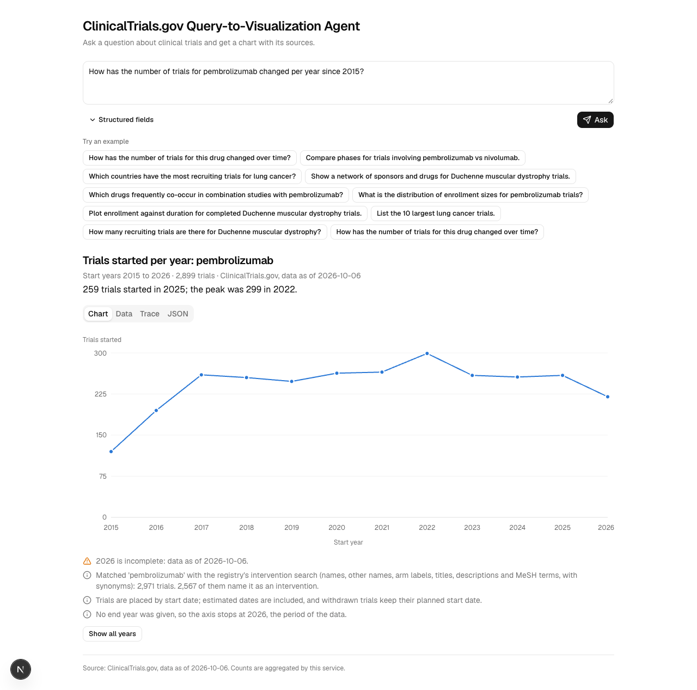
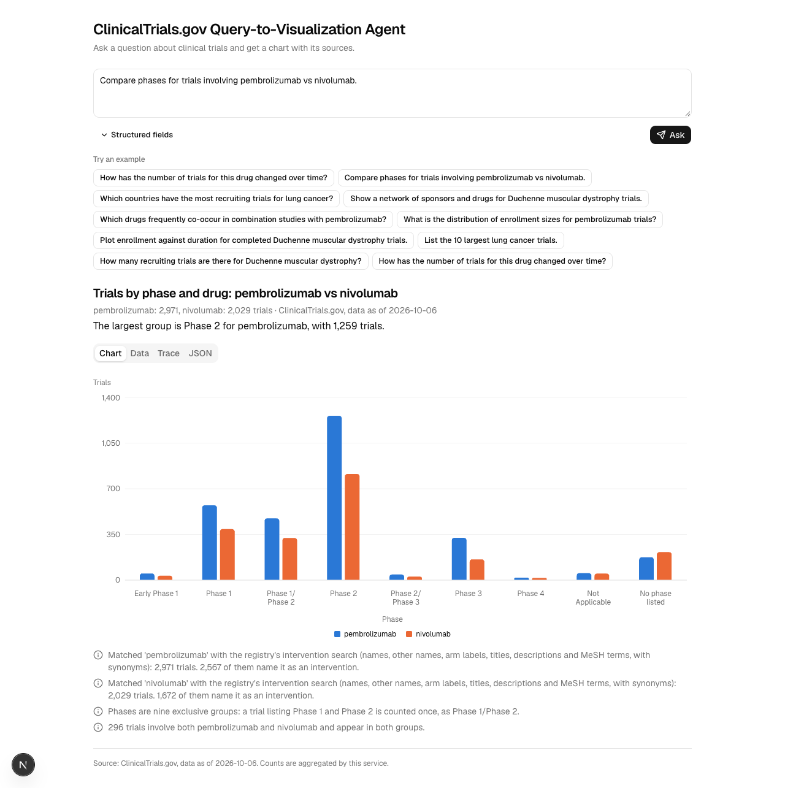
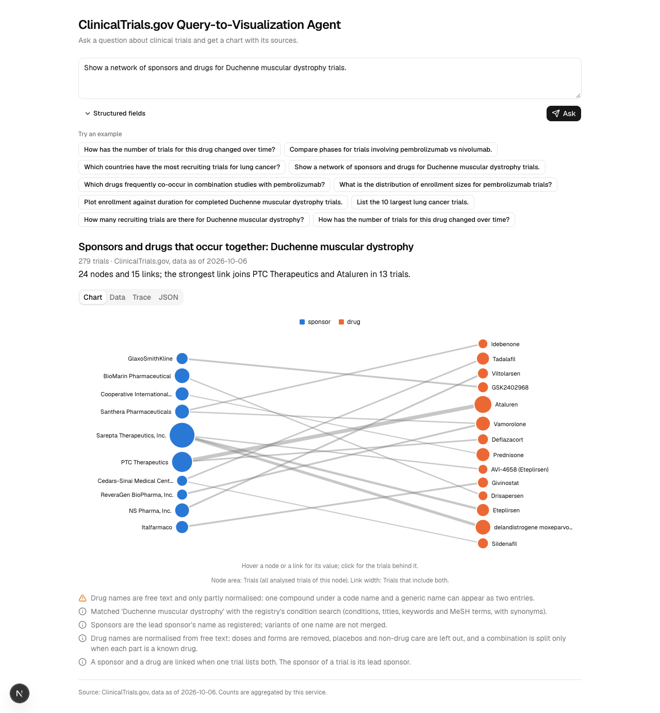

# ClinicalTrials.gov Query-to-Visualization Agent

Ask a question about clinical trials and get back a visualization specification: a chart, a number or a table, as structured JSON that a frontend can render without guessing. One model call turns the question into a small typed plan; everything after that is plain code that runs the plan against the live [ClinicalTrials.gov](https://clinicaltrials.gov) API, counts and groups the trials, picks one of seven visualization types by rule, and cites the trial records behind every value. The backend is a FastAPI service, and a Next.js demo renders its answers with one component per visualization type.





The three screenshots are the demo (`frontend/`) answering questions against the live API on 2026-10-06.

Jump to: [Quick start](#quick-start) | [Example request](#one-request-and-an-abridged-response) | [Request schema](#request-schema) | [Response schema](#response-schema) | [How a question becomes a chart](#how-a-question-becomes-a-chart) | [Query coverage](#query-coverage) | [Example runs](#example-runs) | [Design decisions](#key-design-decisions-and-tradeoffs) | [Validation](#how-correctness-was-validated) | [Limitations](#limitations-and-what-i-would-improve) | [How this was built](#how-this-was-built) | [Data source](#data-source-and-attribution)

## Quick start

### With Docker

Needs only Docker with Compose 2.24 or newer.

```bash
cp .example.env .env              # optional: put your OpenAI key in .env to enable free-text questions
docker compose up --build --wait  # builds both images; returns when both containers are healthy
```

Open <http://localhost:3000> for the demo and <http://localhost:8000/docs> for the API (Swagger UI). `docker compose down` stops everything. If a port is taken, move it: `FRONTEND_PORT=3001 BACKEND_PORT=8001 docker compose up --build --wait`.

The copied `.env` holds the placeholder `your_openai_api_key`, which the service treats as no key (see "What works with no API key"). Only the backend container receives `.env`; the frontend container gets no secret. Never paste the output of `docker compose config`: it prints `env_file` values in clear text.

### Without Docker

Prerequisites: [uv](https://docs.astral.sh/uv/) 0.12 or newer for the backend (it installs Python 3.13 if needed), and for the demo Node 22.22.2 or newer, 24.15 or newer, or 26 and up (the frontend's test environment, jsdom 30, requires one of these), with pnpm 12.

```bash
make setup             # installs both projects from their lockfiles
cp .example.env .env   # optional, as above
make dev               # the API on http://127.0.0.1:8000 (Swagger at /docs) and the demo on http://localhost:3000
make test              # backend and frontend tests: no key, no network
```

`make api` binds port 8000 and the demo asks for 3000 (Next.js takes the next free port and says which). If 8000 is taken, run the `uvicorn` command below with another `--port` and start the demo with `BACKEND_URL=http://127.0.0.1:<port> pnpm dev`.

The Makefile is written for GNU Make 3.81 (what macOS ships), and every target is a plain command line, so nothing depends on make:

| `make` target | What it runs |
| --- | --- |
| `setup` | `cd backend && uv sync --locked` and `cd frontend && pnpm install --frozen-lockfile` |
| `api` | `cd backend && uv run uvicorn ctviz.api.app:create_app --factory --host 127.0.0.1 --port 8000` |
| `web` | `cd frontend && pnpm dev` |
| `dev` | `api` and `web` together in one terminal; Ctrl-C stops both |
| `test` | `cd backend && uv run pytest --block-network --record-mode=none` and `cd frontend && pnpm test` |
| `check` | the backend's `ruff check`, `ruff format --check`, `mypy src`, tests and `scripts/gen_docs.py --check`, then the frontend's `gen-types.mjs --check`, `typecheck`, `lint`, `test` and `build` |
| `docs` | `cd backend && uv run python scripts/gen_docs.py` and `cd frontend && pnpm gen:types`: regenerate `docs/SCHEMA.md`, `docs/schema/`, `docs/examples/README.md`, the generated blocks of this README and the frontend's types |
| `examples` | `cd backend && uv run python scripts/run_examples.py`, then `make docs`: records the ten example runs again (needs the key and the network) |
| `zip` | `check`, a refusal if the working tree has uncommitted changes (the archive holds only what is committed), then `git archive` of HEAD into `dist/submission.zip`, then `scripts/check_submission.py` on it |
| `up`, `down`, `smoke` | `docker compose up --build --wait`, `docker compose down`, and `bash docker-smoke.sh` (builds both images and checks the stack) |

The backend alone runs with stock Python 3.12 or newer, with no uv and no make:

```bash
cd backend
python3 -m venv .venv && . .venv/bin/activate
pip install -r requirements.txt
PYTHONPATH=src uvicorn ctviz.api.app:create_app --factory --host 127.0.0.1 --port 8000
```

### What works with no API key

The key is needed for one thing: the model that reads a free-text question. Everything else runs without it, and with the placeholder key of `.example.env`:

- `GET /v1/examples` and `GET /v1/examples/{slug}` serve the ten recorded runs: request, plan and complete response. `GET /v1/capabilities`, `GET /v1/schema/{name}` and Swagger at `/docs` work too.
- `POST /v1/analyses` runs a typed plan against the live registry with no model. A recorded plan gives the same chart again (this posts the plan of the network example, and needs the API running and `jq`):

  ```bash
  jq -c '{plan: .meta.plan, options: .meta.options}' docs/examples/04-sponsor-drug-network/response.json \
    | curl -s -X POST http://127.0.0.1:8000/v1/analyses -H 'Content-Type: application/json' -d @- | jq -r .message
  ```

- `POST /v1/query` with `"options": {"planner": "structured"}` and `group_by` builds the plan from the request fields alone; the question text is then not read, and the response says so (warning `question_not_interpreted`):

  ```bash
  curl -s -X POST http://127.0.0.1:8000/v1/query -H 'Content-Type: application/json' \
    -d '{"query": "Trials by phase for pembrolizumab", "drug_name": "pembrolizumab", "group_by": ["phase"], "options": {"planner": "structured"}}' | jq -r .message
  ```

- A free-text question without a key is answered `503 planner_unavailable`, and the message names these two alternatives and the examples.
- The demo opens on the ten recorded runs as chips. Picking one shows its recorded answer at once, marked "Recorded", with no model call and no registry call. "Run live" repeats it against ClinicalTrials.gov: with a key it sends the example's own request to the model, and without one it posts the recorded plan to `/v1/analyses` (the badge then says "Live data, recorded plan"). A typed question needs the key; without one the page says so and points to the examples.

### Where things are

Repository map: `backend/src/ctviz/contract/` (the request, plan and response models, from which the schemas are generated), `planning/` (the model call and the plan checks), `catalog/` (the 22 dimensions), `engine/` (scopes, strategies, group-by, networks), `viz/` (type choice, builders, citations, templated text), `ctgov/` (the registry client), `api/` (routes); `frontend/` (the demo); `docs/` (`SCHEMA.md`, `schema/`, `examples/`, `screenshots/`, `spikes.md`).

### Configuration

The root `.env` is the only file to edit (`cp .example.env .env`). It holds the three variables of `.example.env`; every other setting is optional, has a default, and is read from a `CTVIZ_`-prefixed variable. `.example.env` lists twelve allowed models, and `gpt-5.4-mini` and `gpt-4.1-mini`, the planner defaults, are among them. A key exported in the shell overrides the file; the start-up log says, for each variable, which of the two it used (never the value). `CTVIZ_ENV_FILE` points the service at another env file.

<!-- gen:config:start -->
| Variable | Default | What it does |
| --- | --- | --- |
| `OPENAI_API_KEY` | none | The planner's key. Blank, or the placeholder of `.example.env`, counts as no key. |
| `OPENAI_API_BASE` | `https://api.openai.com/v1` | Base URL of the OpenAI API; it must offer the Responses API. |
| `ALLOWED_MODELS` | none | Comma-separated models the key may use. Once a key is set, the planner models must be in it. |
| `CTVIZ_PLANNER_MODEL` | `gpt-5.4-mini` | The model that writes plans. |
| `CTVIZ_PLANNER_EFFORT` | `low` | Reasoning effort sent with the planner model; the families without one get temperature 0. |
| `CTVIZ_PLANNER_FALLBACK_MODEL` | `gpt-4.1-mini` | Asked once when the planner model fails. |
| `CTVIZ_PLANNER_TIMEOUT_S` | `20` | Seconds to wait for one model call. |
| `CTVIZ_CTGOV_BASE_URL` | `https://clinicaltrials.gov/api/v2` | The ClinicalTrials.gov Data API. |
| `CTVIZ_CTGOV_CONCURRENCY` | `6` | Registry requests in flight at once. |
| `CTVIZ_CTGOV_BURST` | `10` | Registry requests let through at once. |
| `CTVIZ_CTGOV_RATE_PER_S` | `8` | Registry requests per second after the burst. |
| `CTVIZ_ONE_PAGE_MAX` | `1000` | The most trials one registry request returns (its page-size limit). |
| `CTVIZ_WALK_PAGES_PER_S` | `5` | Registry requests per second that a paged walk is assumed to make, used to estimate whether a walk fits the request deadline. A walk has no limit on trials. |
| `CTVIZ_MAX_FANOUT_REQUESTS` | `60` | The most count requests one question may make. |
| `CTVIZ_LOW_MATCH_THRESHOLD` | `10` | A name that matches fewer trials gets the `low_match_count` warning. |
| `CTVIZ_REQUEST_DEADLINE_S` | `45` | Seconds before a request is answered 504 `deadline_exceeded`. |
| `CTVIZ_CACHE_TTL_S` | `900` | Seconds a registry answer is kept in memory. |
| `CTVIZ_PLAN_CACHE_SIZE` | `512` | Plans kept in memory. |
| `CTVIZ_RESPONSE_CACHE_SIZE` | `256` | Finished responses kept in memory. |
| `CTVIZ_EXAMPLES_DIR` | none | The folder `GET /v1/examples` reads (default `docs/examples`). |
| `CTVIZ_LOG_FORMAT` | `console` | `console` or `json`. |
<!-- gen:config:end -->

## One request and an abridged response

The assignment's own example, run through `POST /v1/query` (needs the key in `.env`):

```bash
curl -s -X POST http://127.0.0.1:8000/v1/query -H 'Content-Type: application/json' \
  -d '{"query": "How has the number of trials for this drug changed over time?", "drug_name": "Pembrolizumab"}'
```

The structured field `drug_name` is what "this drug" refers to, and the answer is a `time_series` of trials started per year. Below is the recorded run [`docs/examples/01-assignment-request/`](docs/examples/01-assignment-request/response.json), cut down: two rows, one citation each, one reference, the `meta` blocks that the schema reference describes folded to `"..."`, and strings cut at 100 characters.

<!-- gen:response-example:start -->
The service matched 2,971 trials with 36 requests to ClinicalTrials.gov and answered in 7.2 s, of which the model call took 1.7 s. The series starts in 2008, the first period with a trial; empty periods before it are left out.

```json
{
  "spec_version": "1.0",
  "kind": "visualization",
  "message": "259 trials started in 2025; the peak was 299 in 2022.",
  "visualization": {
    "type": "time_series",
    "title": "Trials started per year: Pembrolizumab",
    "subtitle": "Start years 2008 to 2026 · 2,959 trials · ClinicalTrials.gov, data as of 2026-10-06",
    "mark": "line",
    "stack": "none",
    "encoding": {
      "x": {"field": "start_year", "type": "temporal", "title": "Start year", "time_unit": "year"},
      "y": {
        "field": "trial_count",
        "type": "quantitative",
        "title": "Trials started",
        "unit": "trials",
        "format": ",d",
        "scale": "linear"
      },
      "series": null,
      "tooltip": []
    },
    "data": [
      {
        "citations": [{"nct_id": "NCT04898751", "field": "protocolSection.statusModule.startDateStruct.date", "excerpt": "2008-01-01"}],
        "citation_count": 1,
        "source_url": "https://clinicaltrials.gov/api/v2/studies?query.intr=Pembrolizumab&filter.advanced=AREA%5BStartDa...",
        "start_year": "2008",
        "trial_count": 1
      },
      {
        "citations": [],
        "citation_count": 0,
        "source_url": "https://clinicaltrials.gov/api/v2/studies?query.intr=Pembrolizumab&filter.advanced=AREA%5BStartDa...",
        "start_year": "2009",
        "trial_count": 0
      },
      "... 17 more rows"
    ]
  },
  "clarification": null,
  "references": {
    "NCT04898751": {
      "title": "Analysis of Reporting of Cutaneous Toxicities Associated With Immune Checkpoint Inhibitors",
      "url": "https://clinicaltrials.gov/study/NCT04898751",
      "scope_evidence": []
    },
    "...": "76 more trials"
  },
  "meta": {
    "request_id": "3bc29ba6-7304-4e2f-8319-dab6b3d19cd3",
    "generated_at": "2026-10-07T02:47:17.183228Z",
    "query": "How has the number of trials for this drug changed over time?",
    "filters": {
      "drug_name": ["Pembrolizumab"],
      "condition": [],
      "sponsor": [],
      "country": [],
      "term": [],
      "trial_phase": [],
      "status": [],
      "study_type": [],
      "sponsor_class": [],
      "intervention_type": [],
      "sex": [],
      "age_group": [],
      "allocation": [],
      "masking": [],
      "primary_purpose": [],
      "has_results": [],
      "intervention_model": [],
      "start_year": null,
      "end_year": null,
      "date_field": "start_date",
      "compare": null,
      "exclude": {"drug_name": [], "condition": [], "sponsor": [], "country": [], "term": [], "status": []}
    },
    "interpretation": "...",
    "plan": "...",
    "options": "...",
    "planner": "...",
    "conversation": {"is_follow_up": false, "carried_over": [], "changed": []},
    "assumptions": [
      "Read 'Pembrolizumab' as a drug: 2,567 trials have it in an intervention name and 15 in a conditio...",
      "Trials are placed by start date; estimated dates are included, and withdrawn trials keep their pl...",
      "No end year was given, so the axis stops at 2026, the period of the data."
    ],
    "warnings": [{"code": "partial_period", "message": "2026 is incomplete: data as of 2026-10-06."}],
    "source": {
      "name": "ClinicalTrials.gov",
      "url": "https://clinicaltrials.gov",
      "api_version": "2.0.5",
      "data_timestamp": "2026-10-06T09:00:05",
      "retrieved_at": "2026-10-07T02:47:17.183228Z",
      "study_url_template": "https://clinicaltrials.gov/study/{nct_id}",
      "record_url_template": "https://clinicaltrials.gov/api/v2/studies/{nct_id}",
      "fhir_url_template": "https://clinicaltrials.gov/api/v2/studies/{nct_id}?format=fhir.json",
      "requests": ["... 36 more requests"]
    },
    "counts": {
      "data_points": 19,
      "series": [
        {
          "label": null,
          "trials_matched": 2971,
          "trials_analyzed": 2959,
          "trials_excluded": [
            {"reason": "after_window", "count": 7, "message": "After the periods shown"},
            {"reason": "no_start_date", "count": 5, "message": "No start date on record"}
          ]
        }
      ],
      "trials_in_several_series": null
    },
    "truncation": {"is_truncated": false, "items": []},
    "citations": {
      "is_enabled": true,
      "max_per_datum": 5,
      "selection": "most relevant trials by ClinicalTrials.gov's own ranking",
      "trials_cited": 77
    },
    "suggested_followups": "...",
    "cache": "...",
    "timing": "...",
    "debug": "..."
  }
}
```
<!-- gen:response-example:end -->

## Request schema

Questions go to `POST /v1/query` as a `QueryRequest`. `query` is required. Every other field is optional: filters that narrow the question, an `exclude` that leaves trials out ("excluding terminated studies"), and hints (`group_by`, `time_unit`, `top_n`, `chart_type`) that override what the model chose. A structured field wins over the model's reading of the question. `POST /v1/analyses` takes an `AnalysisRequest`, a typed plan with no question, and answers without a model. Both reject an unknown key with HTTP 422 naming it, so `drug` is never silently ignored for `drug_name`.

<!-- gen:endpoints:start -->
| Method and path | What it does |
| --- | --- |
| `GET /healthz` | Liveness: the process is up |
| `GET /readyz` | Readiness: the registry answers, and the configured models are listed by the key |
| `POST /v1/query` | Answer a question with a visualization specification |
| `POST /v1/query/stream` | Answer a question, reporting progress as server-sent events |
| `POST /v1/analyses` | Run a typed plan, with no model call |
| `GET /v1/capabilities` | Dimensions, limits and planner state |
| `GET /v1/schema/{name}` | A JSON Schema of the contract |
| `GET /v1/examples` | The recorded example runs |
| `GET /v1/examples/{slug}` | One recorded run: request, plan and response |
<!-- gen:endpoints:end -->

`GET /healthz` is liveness only. `GET /readyz` asks the registry for its version and the model provider for its model list: it answers 503 only when the registry is unreachable, and reports, without failing on it, whether the key lists the configured models. Swagger UI is at `/docs` and the OpenAPI document at `/openapi.json`, with a copy in [`docs/schema/openapi.json`](docs/schema/openapi.json). The tables below are generated from the Pydantic models; [`docs/SCHEMA.md`](docs/SCHEMA.md) has the same for every type, including the query plan that `POST /v1/analyses` takes, and [`docs/schema/`](docs/schema/) holds the JSON Schemas.

<!-- gen:request-schema:start -->
#### QueryRequest

A question about clinical trials, with optional structured fields.

Strings are trimmed and unknown keys are rejected. Rules across fields:

1. Structured filter fields are ANDed with what the question says. Where they conflict, the field
   wins: it replaces the planner's value for the same entity kind or filter family, and the
   override is recorded in `meta.interpretation.adjustments`.
2. A structured entity field whose value is one of the compared values does not become an extra
   filter; the comparison is kept.
3. Entity arrays mean "all of"; enum arrays mean "any of". A comparison is always explicit:
   `compare` in the request or an "A vs B" in the question.
4. `group_by`, `time_unit`, `top_n` and `chart_type` replace the planner's choices.
5. Every structured field is shown to the model, so "this drug" in the question resolves to
   `drug_name`.
6. With `previous`, the message may be a follow-up: the planner edits the previous plan, or ignores it
   when the message is unrelated. A name, year or filter may then come from the message or be carried
   over unchanged from the previous plan; one that is in neither is rejected.
7. `meta.filters` in every response repeats the filter fields in canonical form (arrays for list
   fields, every key present), so it can be sent back as request fields. For that reason every list
   field accepts an empty array as "no filter", the same as null.

| Field | Type | Required | Default | Constraints | Description |
| --- | --- | --- | --- | --- | --- |
| `query` | string | yes |  | 1 to 1,000 characters | The natural-language question. Tabs and line breaks become spaces and runs of whitespace collapse before validation, because a pasted question can carry line breaks. Then 1 to 1,000 characters, at least one letter and no other control characters. |
| `drug_name` | string[] \| null | no | `null` | at most 5 items; each 1 to 200 characters | Drugs the trials must test, up to 5, each 1 to 200 characters; a single string is accepted. A trial must match all of them. Searched with the registry's intervention search, so brand and code names resolve (Keytruda and MK-3475 return the same trials as pembrolizumab). |
| `condition` | string[] \| null | no | `null` | at most 5 items; each 1 to 200 characters | Conditions the trials must study; same rules as `drug_name`, searched with the registry's condition search. |
| `sponsor` | string[] \| null | no | `null` | at most 5 items; each 1 to 200 characters | Lead-sponsor names; same rules as `drug_name`, searched in the lead sponsor name. |
| `country` | string[] \| null | no | `null` | at most 5 items; each 1 to 200 characters | Countries; same rules as `drug_name`. Each must resolve to one of the registry's country names (common aliases and ISO alpha-2 or alpha-3 codes are accepted), otherwise the request is refused with close matches. A trial must list a site in every named country. |
| `term` | string[] \| null | no | `null` | at most 5 items; each 1 to 200 characters | Other search words, matched anywhere in the record; same rules as `drug_name`. |
| `trial_phase` | (`EARLY_PHASE1` \| `PHASE1` \| `PHASE2` \| `PHASE3` \| `PHASE4` \| `NA`)[] \| null | no | `null` |  | Phases, any of. Lenient spellings are normalised before validation: 'Phase 2', 'phase2', '2' and 'II' become PHASE2, and 'Phase 2/3' becomes both PHASE2 and PHASE3; a single value is accepted. 'Lists this phase' semantics, as on the registry's website: PHASE2 also matches Phase 1/Phase 2 and Phase 2/Phase 3 trials. |
| `status` | (`NOT_YET_RECRUITING` \| `RECRUITING` \| `ENROLLING_BY_INVITATION` \| ... 14 values)[] \| null | no | `null` |  | Study-level overall statuses, any of. |
| `study_type` | (`INTERVENTIONAL` \| `OBSERVATIONAL` \| `EXPANDED_ACCESS`)[] \| null | no | `null` |  | Study types, any of. |
| `sponsor_class` | (`NIH` \| `FED` \| `OTHER_GOV` \| ... 9 values)[] \| null | no | `null` |  | Classes of the lead sponsor, any of. |
| `intervention_type` | (`BEHAVIORAL` \| `BIOLOGICAL` \| `COMBINATION_PRODUCT` \| ... 11 values)[] \| null | no | `null` |  | Trials with at least one intervention of these types, any of. |
| `sex` | (`FEMALE` \| `MALE` \| `ALL`)[] \| null | no | `null` |  | Sexes the trials accept, any of. |
| `age_group` | (`CHILD` \| `ADULT` \| `OLDER_ADULT`)[] \| null | no | `null` |  | Age groups the trials include, any of. |
| `allocation` | (`RANDOMIZED` \| `NON_RANDOMIZED` \| `NA`)[] \| null | no | `null` |  | Allocation of interventional trials, any of (RANDOMIZED, NON_RANDOMIZED, NA). |
| `masking` | (`NONE` \| `SINGLE` \| `DOUBLE` \| `TRIPLE` \| `QUADRUPLE`)[] \| null | no | `null` |  | Masking of interventional trials, any of. |
| `primary_purpose` | (`TREATMENT` \| `PREVENTION` \| `DIAGNOSTIC` \| ... 10 values)[] \| null | no | `null` |  | Primary purposes, any of. |
| `has_results` | (`true` \| `false`)[] \| null | no | `null` |  | 'true': results posted; 'false': none posted. |
| `intervention_model` | (`PARALLEL` \| `CROSSOVER` \| `FACTORIAL` \| `SEQUENTIAL` \| `SINGLE_GROUP`)[] \| null | no | `null` |  | Assignment models of interventional trials, any of. |
| `start_year` | integer \| null | no | `null` | 1900 to 2100 | First year, inclusive, of the date named by `date_field`. Not after `end_year`. |
| `end_year` | integer \| null | no | `null` | 1900 to 2100 | Last year, inclusive, of the date named by `date_field`. Not before `start_year`. |
| `date_field` | `start_date` \| `primary_completion_date` \| `completion_date` \| `first_posted_date` \| null | no | `null` |  | Which date the year bounds apply to. Null means the date on the time axis when the chart has one, otherwise the study start date. |
| `compare` | [`CompareSpec`](docs/SCHEMA.md#comparespec) \| null | no | `null` |  | Compare these as series. Replaces any comparison found in the question. |
| `exclude` | [`ExcludeSpec`](docs/SCHEMA.md#excludespec) \| null | no | `null` |  | Leave out trials that match any listed entity or have any listed status ('excluding diabetes', 'without terminated studies'). Replaces what the planner read for the same entity kind or for statuses; an empty object is no exclusion. |
| `group_by` | (`phase` \| `overall_status` \| `study_type` \| ... 22 values)[] \| null | no | `null` | 1 to 2 items | Analysis hint: the first key is the axis, the second the series. The second key must be one of the closed dimensions (phase, overall_status, study_type, sponsor_class, intervention_type, sex, age_group, allocation, masking, primary_purpose, has_results, intervention_model). Overrides what the planner chose. Required when `options.planner` is 'structured'. |
| `time_unit` | `year` \| `quarter` \| `month` \| null | no | `null` |  | Analysis hint: bucket width for a date dimension. |
| `top_n` | integer \| null | no | `null` | 1 to 50 | How many categories or rows to keep. Default 15, or 10 for the rows of a trial list. Network sizes are fixed in v1. |
| `chart_type` | `bar_chart` \| `time_series` \| `histogram` \| `scatter_plot` \| `network_graph` \| `table` \| `metric` \| null | no | `null` |  | A preference. Honoured when valid for the data shape, otherwise ignored with a warning. |
| `previous` | [`PreviousTurn`](docs/SCHEMA.md#previousturn) \| null | no | `null` |  | The previous turn, for a follow-up such as 'now split that by phase'. Null (the default) is a new conversation. Part of the plan cache key. |
| `options` | [`RequestOptions`](docs/SCHEMA.md#requestoptions) | no | *(see type)* |  | Behaviour switches of one request; `meta.options` echoes the effective values. |

#### RequestOptions

Behaviour switches of one request; `meta.options` echoes the effective values.

| Field | Type | Required | Default | Constraints | Description |
| --- | --- | --- | --- | --- | --- |
| `planner` | `llm` \| `structured` | no | `llm` |  | 'llm': the model writes the plan (503 `planner_unavailable` when no model is configured). 'structured': never call a model; the plan is built from the request fields and `group_by` is required. The question text is then not interpreted, and the response says so. Ignored by `POST /v1/analyses`. |
| `citations_per_datum` | integer | no | `5` | 0 to 20 | Trials cited for each datum; 0 disables citations. |
| `drug_match` | `broad` \| `name_only` | no | `broad` |  | 'broad': the registry's intervention search (names, other names, titles, descriptions, synonyms). 'name_only': intervention names and their synonyms only. The two give different counts, so the definition used is always stated in the response. |
| `include_trace` | boolean | no | `true` |  | Include the step list in `meta.debug.trace`. |
| `use_cache` | boolean | no | `true` |  | false bypasses the plan cache and the response cache for this request; the registry-call cache stays. |

#### CompareSpec

Values of one entity kind to compare side by side, one series each.

| Field | Type | Required | Default | Constraints | Description |
| --- | --- | --- | --- | --- | --- |
| `field` | `drug_name` \| `condition` \| `sponsor` \| `country` | yes |  |  |  |
| `values` | string[] | yes |  | 2 to 5 items; each 1 to 200 characters |  |
<!-- gen:request-schema:end -->

## Response schema

Every HTTP 200 body has the same seven keys: `spec_version`, `kind`, `message`, `visualization`, `clarification`, `references` and `meta`. Every key is always present: `null` means not applicable and an array is never null. `kind` is one of four values:

| `kind` | When | `visualization` | `message` |
| --- | --- | --- | --- |
| `visualization` | The question was answered | The specification below | A one-sentence headline computed from the data |
| `clarification` | A required name is missing ("this drug" with no `drug_name`), a placeholder such as "Drug A" was left in, a country or phase is unknown, the plan could not be checked, or a time axis would be too broad to count exactly | `null` | A templated question; `clarification.options` hold complete request bodies a button can post |
| `no_data` | The plan ran and nothing matched, or a network has too little co-occurrence | `null` | Names what matched nothing, with counts |
| `unsupported` | Not about trials, needs data the registry does not hold, a single-trial lookup, an analysis the service does not draw, or the model declined | `null` | A fixed sentence per category |

Messages, titles, assumptions and warnings are written by code from templates. No sentence the model wrote reaches them.

### The seven visualization types

`visualization` has `type`, `title`, `subtitle` (scope, number of trials, data date and any subset), `encoding` and `data`, plus the extra keys below. The encoding maps visual channels to row keys. `data` holds flat rows, one per drawn mark, already aggregated, sorted, zero-filled and truncated, so a renderer never filters, sorts or computes.

<!-- gen:response-types:start -->
| `type` | Extra keys | `encoding` keys | `data` |
| --- | --- | --- | --- |
| `bar_chart` | `orientation`: `vertical` \| `horizontal`; `stack`: `none` \| `stacked` | `x`, `y`, `series`, `tooltip` | One row per (x, series), following `x.domain`; with a series every combination is present. |
| `time_series` | `mark`: `line` \| `bar` \| `area`; `stack`: `none` \| `stacked` | `x`, `y`, `series`, `tooltip` | One row per (period, series), ascending and zero-filled. |
| `histogram` | none | `x`, `x2`, `y`, `label`, `tooltip` | One row per bin, contiguous and ascending. Bins may be uneven: draw one bar per row using the label. |
| `scatter_plot` | none | `x`, `y`, `series`, `size`, `label`, `tooltip` | One row per trial; each row cites itself with the fields its coordinates came from. |
| `network_graph` | `is_directed`: `false`; `layout`: `force` \| `bipartite` | `nodes`, `edges` | Nodes and links; `source` and `target` of a link are node ids. |
| `table` | none | `columns` | One row per record; `href_field` names a row key holding a URL. |
| `metric` | none | `value` | A single number, with citations and `source_url` like any datum. |
<!-- gen:response-types:end -->

Row keys are predictable (`trial_count`, `share`, `group`, `bin_start`, `start_year`, and for a network `id`, `source`, `target`); the rules, the channel types and every field are in [`docs/SCHEMA.md`](docs/SCHEMA.md), and the JSON Schema of the whole contract (request, plan, response and error body) is [`docs/schema/contract.v1.schema.json`](docs/schema/contract.v1.schema.json). No colours are sent: colour `i` belongs to `domain[i]`. A period is a label (`2015`, `2024-Q2`) to treat as an ordered category and never parse as a date. A category channel says `is_exclusive: false` when a trial can fall under several values (countries, drugs, intervention types), and then its values must not be drawn as parts of a whole.

### Where the assignment's items live

| The assignment asks for | Where it is |
| --- | --- |
| `type`, `title`, `encoding`, `data` | `visualization.type`, `.title`, `.encoding`, `.data` |
| Whether a visualization is needed, and which type | `kind`; `visualization.type`; `meta.interpretation.chart_rationale` names the rule that chose the type. A `metric` (one number) and a `table` (a list of trials) are the answers that need no chart |
| Units | `encoding.<channel>.unit` and `.format` |
| Sorting | Row order, which is authoritative. A category axis also states it in `encoding.x.domain` and `encoding.x.sort`, a series in `encoding.series.domain`; a time axis ascends by period; a trial list follows `meta.plan.analysis.sort_by` and `.order` |
| Time granularity | `encoding.x.time_unit`, `meta.interpretation.time_granularity` |
| Grouping choices | `encoding.series`, `meta.interpretation.group_by` and `.compare` |
| Assumptions | `meta.assumptions`; `meta.interpretation.adjustments` lists what the service changed in the plan |
| Filters applied | `meta.filters`, in request field names, so it can be sent back as request fields; the exact upstream URLs are in `meta.source.requests` |
| Query interpretation | `meta.interpretation.summary` (written by code from the plan), `.entities` (what the registry made of each name), `meta.plan` |
| Source and data date | `meta.source.name`, `.api_version`, `.data_timestamp` |
| Deep citations | `citations`, `citation_count` and `source_url` on every datum, and the top-level `references` |

### Citations

Every datum cites up to `options.citations_per_datum` trials (5 by default, at most 20, 0 turns citations off) as `{nct_id, field, excerpt}`: `field` is the path in the trial record (`GET /api/v2/studies/{nct_id}`) and `excerpt` the value found there, verbatim. `null` means the field is absent, and the absence is the evidence. `citation_count` is the number of trials behind the datum and the citations are a sample of them: the registry's own relevance order when the count came from a count request, and for a walk the trials that name the searched entity first, then the most recently first-posted. `meta.citations.selection` says which. `source_url` is a registry URL that returns exactly the counted trials, where one exists. A trial's title and link are in `references` once, however many rows cite it.

Three of the response invariants make this checkable at run time: every NCT ID in a response was returned by ClinicalTrials.gov during that request; every excerpt equals the value at its path in the record held in memory; and a count drawn from a count request equals the `totalCount` of that logged request. A response that breaks one is a 500, never an answer with false evidence. `references[*].scope_evidence`, which would say why each trial is in scope, is in the schema but is always an empty array in this version.

### Errors

Every non-2xx response, from the backend and from the demo's proxy, has this body (a real one, for a misspelt field):

```json
{"error": {"code": "invalid_request", "message": "Invalid request at /drug: Unknown field.",
           "details": {"errors": [{"path": "/drug", "code": "extra_forbidden", "message": "Unknown field."}]},
           "request_id": "fbf0aaef-fb7f-4c7a-85b1-37fd8493e837", "is_retryable": false}}
```

<!-- gen:errors:start -->
| `error.code` | HTTP status | Retryable | Meaning |
| --- | --- | --- | --- |
| `invalid_request` | 422 | no | The body broke a validation rule; `details.errors` lists each path, code and message. |
| `not_found` | 404 | no | No such path, schema or recorded example. |
| `method_not_allowed` | 405 | no | The path exists but not for this method. |
| `planner_unavailable` | 503 | no | No model could write a plan; `details.reason` is `not_configured`, `configuration` or `transient`. Only `transient` is retryable. Structured mode and `/v1/analyses` need no model. |
| `upstream_unavailable` | 502 | yes | ClinicalTrials.gov answered 5xx, refused the connection or sent an unreadable body, after retries. |
| `upstream_rate_limited` | 503 | yes | ClinicalTrials.gov kept throttling after backoff; `Retry-After` is set. |
| `upstream_timeout` | 504 | yes | ClinicalTrials.gov did not answer in time, after retries. |
| `deadline_exceeded` | 504 | yes | The request ran past its own deadline (45 s by default). |
| `internal_error` | 500 | no | A bug, or an answer that failed an internal consistency check and was withheld instead of sent. Quote `request_id`. |
| `backend_unreachable` | 502 | yes | Sent only by the frontend's proxy: the backend did not answer. |
<!-- gen:errors:end -->

## How a question becomes a chart

Every question goes through the same nine steps, whatever its class. Only the second step involves a model.

1. **Request.** Pydantic validates the body into a `QueryRequest`. A question may carry line breaks; they become spaces.
2. **Plan.** One OpenAI Responses API call with a strict structured-output schema writes a `QueryPlan`: the entities (words copied from the question, each a filter or one side of a comparison), the enum filters with the phrase that states each, the years, one of seven analysis shapes, and a chart preference only if the user names a chart. The model sees the question, today's date and the structured fields, never trial data, and has no tools. With `options.planner: "structured"` no model is called, and `POST /v1/analyses` takes a plan directly.
3. **Check.** `check_plan` is pure code (below). It fixes what it can and records each fix in `meta.interpretation.adjustments`; what needs language understanding goes back to the model once, statelessly; a plan that still fails becomes a `clarification`, never a guess.
4. **Resolve.** Each entity, and each name to leave out, is resolved through the registry's own search with exact count calls: how many trials match, for a drug how many name it as an intervention (`strict_name_matches`), and how many match when the words are read as another kind of entity. A name that matches nothing is `no_data`; a name that matches very few trials gets the warning `low_match_count`.
5. **Strategy.** A pure function of the plan and the size of each scope picks how to fetch: one sorted page (a list of trials), one count request per bucket (a count fan-out, at most 60 requests), or a paged walk of every matching trial (always a walk for a median, mean or sum, which needs the numbers themselves). A walk longer than two pages is split into disjoint ranges of first-posted date, chosen from exact count requests, and the ranges are read at the same time, each with its own page-token chain; the trials read must equal the registry's count, or the response carries the warning `walk_count_mismatch`. There is no limit on trials, only on time: a walk that is estimated not to fit what is left of the request deadline is not started, and the response is a `clarification` with the reason `too_broad` that states how many trials match (a time axis first falls back to the latest periods a fan-out can count).
6. **Execute.** One pooled client sends every request: a concurrency cap of 4, a token bucket (a burst of 10, then 5 per second), retries with backoff, and a cache keyed on the registry's data timestamp. Records are parsed once into typed `Study` objects, and every request is logged in the order issued (`meta.source.requests`).
7. **Shape.** Time window, top-N, ordering, zero-fill, shares, and pruning of networks (nodes and links with the most trials, links of at least 2 trials).
8. **Build.** A rule table maps the plan's shape to one visualization type (below), and one builder per type writes rows, encoding, citations, title, headline, assumptions, warnings, counts and truncation.
9. **Verify.** 17 invariants run on every visualization response before it is sent (below).

### What the model decides and what code decides

| The model decides, from closed choices | Code decides, always |
| --- | --- |
| Which words of the question name a drug, condition, sponsor, country or other term, and whether each is a filter, one side of a comparison or left out | The API parameter, search area and Essie expression used for each; whether the name exists; how many trials match |
| Which enum filters the question states (phase, status, study type, sponsor class, intervention type, and the design fields: sex, age group, allocation, masking, primary purpose, results posted, intervention model) with the phrase that states each, which names or statuses it leaves out, and which years | Whether those words and years are really in the question; what a structured request field overrides |
| The analysis shape and its dimension, statistic, numeric fields or node kinds, from fixed lists | Bucket boundaries, combined-phase handling, the counting unit (one trial), bins, window, strategy, caps, truncation |
| A chart preference, only when the user names a chart form | The visualization type, encoding, sort order, domain, units and number formats |
| That a needed name is missing, or that the question is out of scope | Every number, row, label, title, message, assumption, warning, NCT ID, citation and URL |

The only numbers the model can write are query parameters the user stated (a year, a top-N), and each is checked against the question and clamped. The worst a wrong plan can produce is a valid answer to a different question, which `meta.interpretation.summary`, written by code from the plan, states in plain words.

### Validation: 29 plan rules before any data, 17 invariants after

The 29 numbered rules of `check_plan` (`planning/rules.py`, `merge.py`, `outcomes.py`, `validate.py`) each have a test named for them:

| Rules | Kind | Examples |
| --- | --- | --- |
| 1 to 17 | Fixes, each recorded as an adjustment | Model text that is long, names a trial or holds a number nobody wrote is replaced (1); a filter listing every value of its enum is emptied (2); a structured request field replaces the model's entity, filter or hint (3 to 5); inverted years are swapped (7); one compared name alone becomes a filter (8); at most five are compared (9); a series that repeats the axis and a time unit on a category are dropped, and `same_arm` on anything but drugs becomes `same_trial` (11 to 13); a top-N or limit the user did not write is replaced by the default, and one above 50 is clamped (14, 15); a chart preference the data cannot honour is ignored with a warning (16); a phase its evidence phrase does not state is dropped (17) |
| 18 to 23 | Blocking: sent back to the model once | An entity, a year or a filter that the question does not contain (18 to 20); compared names of different kinds (21); a scatter plot of one measure against itself (22); a network of sponsors with sponsors, or with compared names (23). Entities are grounded by tokens, so `breast cancer` is accepted from "breast and lung cancer", and `Keytruda` is rejected when the question only says "pembrolizumab" |
| 24 to 27 | Answered without data | A placeholder entity ("Drug A", "[condition]", "this drug") is a clarification (24); so is a country the registry does not use, with close names as buttons (25), and "Phase 5" (26); an NCT ID as an entity is unsupported, because the registry ignores every filter when a query holds only NCT IDs (27) |
| 28, 29 | After the repair turn | A filter still not stated is dropped with a warning (28); anything else becomes a `clarification` with the warning `plan_not_repaired` (29) |

The model path makes one call, and at most three: a first attempt, a retry or the fallback model after a failure, and the one repair turn.

The 17 invariants of `contract/invariants.py` are what JSON Schema cannot say: at least one datum; every encoded field present in every row; category values inside their domain; numbers where numbers belong; period labels that ascend with no gaps; the full (x, series) grid with no repeats; bar rows in domain order; a stacked chart only over an exclusive series; contiguous histogram bins; unique node and link ids with no dangling link; `references` holding exactly the cited trials; `trials_matched = trials_analyzed + trials excluded` for every series; a drawn count equal to its `citation_count`; the three provenance checks above (14 to 16); and the partition checksum (17): when every dimension drawn is exclusive, the rows add up to the trials analysed.

### How the visualization type is chosen

`viz/choose.py` is a table of 13 rules, and `meta.interpretation.chart_rationale` quotes the rule that fired. Two numbers per trial: scatter plot. A list of trials: table. One number for one scope: metric; for several scopes: bars side by side. A date dimension: a line over time. Enrollment for one scope with no series: histogram, otherwise grouped bars over the bins. One ordinal category: vertical bars in natural order; one nominal category: horizontal bars sorted by value. A series splits the bars: grouped, and stacked only when the series is exclusive (every trial has exactly one value) and no groups are compared. Two kinds of node: a bipartite network; one kind on both sides: a force-directed network. A chart preference changes this only inside what the data allows (a line may become bars, a histogram may become bars, an aggregate may become a table); otherwise it is ignored with the warning `chart_preference_ignored`.

## Query coverage

Every row goes through the same path: plan, check, resolve, strategy, group-by, build. There is no per-question code.

| Question class | Example question | Visualization | Recorded run |
| --- | --- | --- | --- |
| Trend over time | How has the number of trials for this drug changed over time? (`drug_name`) | `time_series`, a line; one line per group when split | [01](docs/examples/01-assignment-request/) |
| Distribution across a category | How are Duchenne muscular dystrophy trials distributed across phases? | `bar_chart`: vertical in natural order for phase or status, horizontal sorted by value for countries, sponsors, drugs and conditions | |
| Comparison | Compare phases for trials involving pembrolizumab vs nivolumab. | `bar_chart`, grouped, never stacked, because a trial can involve both | [02](docs/examples/02-compare-phases/) |
| Geographic pattern | Which countries have the most recruiting trials for lung cancer? | `bar_chart`, horizontal, top 15, with an ISO code on every row | [03](docs/examples/03-recruiting-by-country/) |
| Network of two kinds | Show a network of sponsors and drugs for Duchenne muscular dystrophy trials. | `network_graph`, bipartite | [04](docs/examples/04-sponsor-drug-network/) |
| Co-occurrence | Which drugs frequently co-occur in combination studies with pembrolizumab? | `network_graph`, force-directed | [05](docs/examples/05-drug-cooccurrence/) |
| Distribution of a number | What is the distribution of enrollment sizes for pembrolizumab trials? | `histogram` | [06](docs/examples/06-enrollment-histogram/) |
| Two numbers per trial | Plot enrollment against duration for completed Duchenne muscular dystrophy trials. | `scatter_plot`, one point per trial | [07](docs/examples/07-enrollment-vs-duration/) |
| A list of trials | List the 10 largest lung cancer trials. | `table`, each row citing itself | [08](docs/examples/08-largest-trials/) |
| One number | How many recruiting trials are there for Duchenne muscular dystrophy? | `metric` | [09](docs/examples/09-recruiting-count/) |
| Two-way breakdown | Phases by sponsor class for Duchenne trials; pembrolizumab trials per year by phase | Stacked bars when the second dimension is exclusive, otherwise grouped; a line per group over time | |
| A statistic of a number | What is the median enrollment of Duchenne muscular dystrophy trials by phase? | `bar_chart` of one value per phase, in participants; a line over time, or a `metric` for one scope | |
| A scope with something left out | Duchenne muscular dystrophy trials by phase, excluding terminated studies | The same chart, its subtitle saying "Status: not Terminated" | |
| Missing or unclear input | The first question again, with no drug named | `clarification`; `no_data` and `unsupported` for a name that matches nothing and for an out-of-scope question | [10](docs/examples/10-no-drug-named/) |

Questions can be filtered by drug, condition, sponsor, country or free text; by phase, status, study type, sponsor class, intervention type and the design fields (sex, age group, allocation, masking, primary purpose, results posted, intervention model); and by the years of a chosen date. Names and statuses can also be left out. The dimensions a result can be grouped by, as `GET /v1/capabilities` reports them:

<!-- gen:capabilities:start -->
| `group_by` key | Kind | A trial counts under | Values |
| --- | --- | --- | --- |
| `phase` | closed list | one value | 9 values |
| `overall_status` | closed list | one value | 14 values |
| `study_type` | closed list | one value | Interventional, Observational, Expanded Access, Not provided |
| `sponsor_class` | closed list | one value | 10 values |
| `intervention_type` | closed list | one or more values | 11 values |
| `sex` | closed list | one value | Female, Male, All, Not provided |
| `age_group` | closed list | one or more values | Child, Adult, Older Adult |
| `allocation` | closed list | one value | Randomized, Non-Randomized, N/A, Not provided |
| `masking` | closed list | one value | 6 values |
| `primary_purpose` | closed list | one value | 11 values |
| `has_results` | closed list | one value | With results, Without results |
| `intervention_model` | closed list | one value | 6 values |
| `country` | open list | one or more values | from the data |
| `state` | open list | one or more values | from the data |
| `sponsor` | open list | one value | from the data |
| `drug` | open list | one or more values | from the data |
| `condition` | open list | one or more values | from the data |
| `start_date` | date | one value | years, quarters or months |
| `primary_completion_date` | date | one value | years, quarters or months |
| `completion_date` | date | one value | years, quarters or months |
| `first_posted_date` | date | one value | years, quarters or months |
| `enrollment` | number, binned | one value | 11 values |

Numeric fields (scatter plots and statistics): `enrollment`, `duration_months`, `site_count`. Network node kinds: `sponsor`, `drug`, `condition`, `country`. Visualization types: `bar_chart`, `time_series`, `histogram`, `scatter_plot`, `network_graph`, `table`, `metric`.

Limits: a request to ClinicalTrials.gov returns at most 1,000 trials; a paged walk reads every matching trial, in date ranges read at once, and is refused as too broad when it is estimated not to fit the deadline at 5 requests a second; a count fan-out makes at most 60 requests; 15 categories by default and at most 50; at most 10 series; at most 60 links in a network; a request is cut off after 45 s.
<!-- gen:capabilities:end -->

## Example runs

Ten questions were run through the service and the answers recorded, unedited, under [`docs/examples/`](docs/examples/): the request, the plan the service ran, and the complete response with every citation and the trace. [`docs/examples/README.md`](docs/examples/README.md) indexes all ten with outcome, headline, trials matched and model. They cover the assignment's own request, five of the nine queries of its appendix (the per-year trend, the drug comparison, the countries, and both networks) and one of each remaining way to answer: a histogram, a scatter plot, a table, a single number and a clarification. The other four appendix queries take the same path with other names and were asked live too (see the validation section).

<!-- gen:examples:start -->
**Featured**

| Run | Question | Visualization | Headline |
| --- | --- | --- | --- |
| [01-assignment-request](docs/examples/01-assignment-request/response.json) | How has the number of trials for this drug changed over time? (drug_name: Pembrolizumab) | `time_series` (line) | 259 trials started in 2025; the peak was 299 in 2022. |
| [02-compare-phases](docs/examples/02-compare-phases/response.json) | Compare phases for trials involving pembrolizumab vs nivolumab. | `bar_chart` (grouped) | The largest group is Phase 2 for pembrolizumab, with 1,259 trials. |
| [03-recruiting-by-country](docs/examples/03-recruiting-by-country/response.json) | Which countries have the most recruiting trials for lung cancer? | `bar_chart` (horizontal) | China is the largest group: 903 of 2,298 trials (39.3%). |
| [04-sponsor-drug-network](docs/examples/04-sponsor-drug-network/response.json) | Show a network of sponsors and drugs for Duchenne muscular dystrophy trials. | `network_graph` (bipartite) | 24 nodes and 15 links; the strongest link joins PTC Therapeutics and Ataluren in 13 trials. |
| [05-drug-cooccurrence](docs/examples/05-drug-cooccurrence/response.json) | Which drugs frequently co-occur in combination studies with pembrolizumab? | `network_graph` (force) | 25 nodes and 60 links; the strongest link joins Carboplatin and Paclitaxel in 145 trials. |

**Also recorded**

| Run | Question | Visualization | Headline |
| --- | --- | --- | --- |
| [06-enrollment-histogram](docs/examples/06-enrollment-histogram/response.json) | What is the distribution of enrollment sizes for pembrolizumab trials? | `histogram` | The most common size range is 25-49, with 649 trials. |
| [07-enrollment-vs-duration](docs/examples/07-enrollment-vs-duration/response.json) | Plot enrollment against duration for completed Duchenne muscular dystrophy trials. | `scatter_plot` | 235 trials plotted, duration against enrollment. |
| [08-largest-trials](docs/examples/08-largest-trials/response.json) | List the 10 largest lung cancer trials. | `table` | 10 of 10 trials, ordered by largest enrollment. |
| [09-recruiting-count](docs/examples/09-recruiting-count/response.json) | How many recruiting trials are there for Duchenne muscular dystrophy? | `metric` | 61 trials match: Duchenne muscular dystrophy; Status: Recruiting. |
| [10-no-drug-named](docs/examples/10-no-drug-named/response.json) | How has the number of trials for this drug changed over time? | `clarification` (nothing to draw) | The question needs a drug name that it does not give. Add it to the question or its field. |
<!-- gen:examples:end -->

Model output is not repeatable, but a recorded plan is: posting it to `POST /v1/analyses` re-runs the same analysis with no model, and the answer is the same until the registry publishes a new data version. The registry refreshes on weekdays; the recorded runs used the version of 2026-10-06. Recording all ten a second time in a scratch copy, about an hour later on the same data version, gave the same headlines, counts, rows, citations and references for every one; in one of the ten the model worded its one-sentence `interpretation` differently, and in the others the plans were identical.

## Key design decisions and tradeoffs

- **One typed plan, one model call, no agent framework.** The model writes a plan from closed choices and code does everything else, so the model never writes a number, a row, an NCT ID, a title or an API parameter. The cost is that a question outside the plan's vocabulary is a clarification or "unsupported" and not an improvised answer. A framework was not used because the pipeline is one structured call and one bounded repair turn, and a framework would hide what must be visible here: per-model parameters, `store=False`, the two truncation shapes. The OpenAI SDK is imported by one module.
- **The same plan is the model's output, the replay input and the echo.** `QueryPlan` is what the model writes, what `POST /v1/analyses` accepts and what every response returns in `meta.plan`, so any answer can be replayed without a model, and the recorded examples stay reproducible although model output is not.
- **One engine.** A field catalogue of 22 dimensions and one group-by sit behind every aggregated chart. A trend is a date dimension, a distribution a category dimension, a comparison several scopes, a network two dimensions whose cells are drawn as links, a co-occurrence network the same dimension twice. Adding a dimension is one catalogue entry. The cost is that the engine works on trial-level fields only: it counts trials, or takes the median, mean or sum of enrollment, duration or site count, and it has no results data.
- **Two exact data primitives, chosen by rule.** The registry has no group-by. A count request per bucket is exact at any size and returns its own citation sample; a paged walk reads every matching trial and serves open vocabularies, scatter plots, networks and statistics. Tests assert that the two give the same frame on real recorded records. A walk is never cut to a recent subset: when the scope is too large to read in time, the question is refused as `too_broad` with the size stated.
- **A custom specification, not Vega-Lite.** Vega-Lite cannot lay out a network and has no place for citations, counts or provenance, and its JSON Schema is about 1.9 MB against 94 kB for this whole contract; a renderer that honoured only part of it would force exactly the guessing the assignment warns about. The vocabulary is borrowed (`field`, `nominal`, `ordinal`, `quantitative`, `temporal`, `domain`, `scale`, number formats), so an adapter for bar and line charts would be small. The cost is that the frontend has its own renderers; the demo is the proof that they can be written from the documented contract.
- **Citations that can be replayed.** Up to five trials per datum with the field path and the verbatim excerpt, titles once in `references`, and a `source_url` that returns exactly the counted trials. Uncapped, a bar of 903 trials would carry 903 records; as it is, each recorded response is under 300 kB. The cost is that a count of 903 cites five trials.
- **Honest counts.** The counting unit is the trial. A phase is one of nine exclusive buckets, with "Phase 1/Phase 2" its own bucket and not counted twice; HL7's research-study phase code system also has combined phases as codes of their own. "Recruiting" is the study-level status (903 for China in lung cancer on 2026-10-06, the number the registry's own query returns). A drug name is matched with the registry's broad intervention search, which resolves brand and code names (`Keytruda` and `MK-3475` are pembrolizumab), and the strict count of trials naming it as an intervention is in every response; `options.drug_match: "name_only"` switches to it. A sponsor is the lead sponsor.
- **Text is templated.** Titles, headlines, assumptions and warnings come from templates filled with computed values. A model-written summary would be the one step where a model writes numbers.
- **Why FHIR is a link and not the data source.** ClinicalTrials.gov offers `format=fhir.json`, but only for one study per request: the same call on `/studies` is a 400 ("Allowed values for parameter `format` are `csv`, `json`"). Counting the 2,971 pembrolizumab trials of 2026-10-06 that way would take 2,971 requests, against a few dozen for the recorded time series. A citation should quote the record the number was computed from, which is the native record already in memory with a stable field path. Each response carries `meta.source.fhir_url_template`, and the demo's citation sheet links each cited trial's FHIR file as a plain link.
- **Python, FastAPI and Pydantic.** One set of models gives request validation, the JSON Schema, the OpenAPI document and the strict-mode schema the model must follow, and the semantic invariants were easy to write over the same models. The cost is a second language for the demo: its types are generated from the JSON Schema and a drift check fails when they go stale.
- **Caches, in process memory.** Registry calls are cached by data timestamp and URL; the model's plan and the finished response are cached too, so a repeated question is answered identically with no external call (`options.use_cache: false` skips the last two). Measured: the assignment's request took 6.8 s and 33 registry requests the first time and 0.01 s with none the second time, and the response says it came from the cache (`meta.cache`). The caches are lost on restart and are not shared between processes.
- **One backend process.** The registry rate limiter and the caches are in the process, so the container must not be started with several workers. Scaling out would put them behind an interface with a Redis implementation.

Alternatives that were weighed and rejected:

| Alternative | Why not |
| --- | --- |
| A generative-UI layer that has the model write the chart | The model would retype data rows, which is the hallucination surface this design removes; a deterministic renderer per type shows the contract better |
| A free tool-calling loop (the model searches, reads records and writes the answer) | The model would read data and write numbers, three to eight round trips, and tool order that varies between runs |
| A keyword planner without a model | It cannot read entity names, so "lung cancer trials by phase" would chart all 606,007 trials (the registry's size on 2026-10-06) |
| A recent-only sample under a time axis | The newest registrations are not the history a trend needs, so the trend would misstate it |
| The website's internal facet endpoint | Faster, but undocumented and absent from the OpenAPI document; the assignment names the Data API |
| A bulk download into a local database | A real group-by and no caps, but it means mirroring the whole registry and it goes stale against a weekday refresh |
| A TypeScript backend | Viable, and one toolchain; Python won on Pydantic giving validation, schema and the model's output format from one model set |

## How correctness was validated

- **Offline tests.** `make test` runs about 950 backend tests in about 6 seconds with the network blocked and no key, and about 140 frontend tests. `make check` adds `ruff`, `mypy --strict`, a drift check on every generated document, and the frontend's type check, lint and build. The backend tests cover Essie escaping of user text; parsing of odd real record shapes (a 1985 record with year-month dates, an observational study with no phases, a withheld record, a trial with 14 arms); the catalogue's extractors and phase buckets; the engine, where a fan-out and a walk are run on the same real recorded records and must give the same frame; each of the 29 plan rules; 15 of the 17 invariants by corrupting a response and expecting that rule (the histogram-bin and graph-link rules, 9 and 10, are only exercised on sound responses); the model adapter against canned SDK responses (success, refusal, cut-off JSON, 429, timeout); and the API through an ASGI transport with a scripted planner: every kind of outcome, the error envelope, the no-key 503, structured mode, `/v1/analyses`.
- **Numbers against registry counts.** The 499 Duchenne muscular dystrophy trials measured on 2026-10-06 are in the tests as reference figures: the nine phase buckets give 10, 49, 47, 88, 11, 50, 11, 91 and 142, which add up to 499. At run time the invariants compare each count row drawn from a count request with the `totalCount` that request returned. For this README I also compared two recorded numbers directly with the live registry on the same data version: lung cancer trials with status recruiting, 2,298, and those with a site in China, 903.
- **Replay.** Recording all ten examples again against the live registry on the same data version reproduced every recorded `visualization`, every count and every reference exactly, and nine of the ten plans exactly (the tenth differed in the wording of the model's one-sentence `interpretation`). Posting a recorded plan to `/v1/analyses` gives the same chart with no model.
- **Live questions with no recorded run.** The four appendix queries that are not among the ten, and the other rows of the coverage table that have no recorded run, were asked live on 2026-10-07: the trials of a condition by phase (499 trials, the reference figures above); the most common intervention types of Duchenne trials (421 trials, drugs first with 225); sponsor categories across two conditions (grouped bars, 499 and 466 trials); trials started per year for lung cancer (a line from 2002 to 2026, 14,002 trials); the median enrollment by phase (a bar chart with its unit); the same by phase without terminated studies (445 trials, and the subtitle says so); phases by sponsor class (stacked bars); pembrolizumab trials per year by phase (nine lines); a question about which trial is most likely to succeed (`unsupported`); a drug that does not exist (`no_data`); and the appendix's "Drug A vs Drug B" (`clarification`). Each took one model call, and the eight that drew a chart needed no adjustment of the plan.
- **The planner on live questions.** [`docs/spikes.md`](docs/spikes.md) records 36 live calls on 2026-10-06: the plan schema was accepted in strict mode by both models, and eight questions (the assignment's own request and seven of the appendix's nine queries) were each run twice. 16 of 16 plans were right in the first batch, with no adjustment by `check_plan`, and 14 of 16 matched a hand-written plan exactly in an independent second batch. The two misses set `chart_preference` to `network_graph` unasked, which changes nothing today.
- **Not done.** Recorded-traffic (cassette) tests and golden tests that replay every example offline; a planner scorecard of 33 questions with repeated runs; a live script that replays every citation against the registry. The ten recorded examples are validated against the response models by `make zip`, and the frontend's tests draw every mark of them.

## Limitations and what I would improve

- **Scope evidence is not filled in.** `references[*].scope_evidence`, meant to show why each trial is in scope, is always `[]`. The registry's search also matches titles, descriptions and synonyms, so a cited trial can look unrelated to the question (a trial that names only `MK-3475` for a pembrolizumab question), and nothing per trial says why it matched.
- **Very broad questions are refused, not sampled.** Sample-then-recount, which would read a sample to find the leaders of an open list and then count each leader exactly, is not built (`sample_then_recount` is a name in the schema that this version never produces). So a question whose open list is too big to read inside the request deadline (countries across all registry trials, or a drug co-occurrence network with no scope) is answered with a `too_broad` clarification that states how many trials match and how long reading them would take. The estimate uses the setting `CTVIZ_WALK_PAGES_PER_S`; no partial answer is drawn.
- **Drug names are free text.** The normaliser removes doses and forms and splits combinations only when each part is a known drug, but it does not merge a code name and a generic name (PTC124 and ataluren stay two nodes), so node and link weights are lower bounds. The warning `names_partly_normalised` says so on every drug dimension.
- **Caps.** No limit on trials per walk (the request deadline bounds it), 60 count requests per question, 10 series, 15 categories by default and 50 at most, 60 links in a network. A median, mean or sum is always read by a walk over every matching trial, or refused as too broad. A time breakdown of a very large scope shortens its window and says so, or asks for a narrower question.
- **The model is lightly tested.** A few dozen live calls (36 recorded in `docs/spikes.md`, then the examples and the questions above) and the offline suite, not a repeated scorecard. Model names are aliases, and a snapshot cannot be pinned; every response records the snapshot the alias resolved to in `meta.planner.model`. The two misses recorded in `docs/spikes.md` show that the model can still add an unasked chart preference.
- **The registry's rate limit is unknown.** The limiter defaults (burst 10, 8 per second, 6 at once) come from a short ramp of 2, 4 and 6 concurrent page walks that drew no 429 or 403 (about 9.5 pages a second at 6); they are not documented limits. After a 429 or 403 the service prefers walks for ten minutes and adds the warning `upstream_throttled`.
- **Not supported:** investigator and site networks, maps (rows carry ISO codes, but there is no map type), results data (outcomes, adverse events), reading trial text, and three-way breakdowns (a comparison together with a series).
- **Answers take seconds, with no progress stream.** A question took between about 1 and 8 s in the recorded runs: a model call of one to three seconds, then a handful to a few dozen registry requests. A server-sent-events stream would let the demo show its steps.
- **One process, no authentication.** The API has no login (Compose binds it to the loopback interface), and the limiter and caches are not shared between processes.

With more time, in this order: sample-then-recount; scope evidence per cited trial; an evaluation harness with repeated runs, cassette tests and golden replays of every example, and a live citation replay; a model-callable `resolve_entity` tool so that a misspelt name can be corrected with evidence; alias learning from `otherNames`; a progress stream; site and investigator networks; and a shared cache and limiter in Redis.

## How this was built

<!-- owner:confirm -->

**Owner: this section lists facts only. Rewrite it in your own words before submitting, say which parts you designed and which were generated and adapted, and delete the marker line above.**

- Tools: Claude Code, an AI coding agent, was used to write the code, tests and documents. The planner calls `gpt-5.4-mini` through the OpenAI Responses API, with `gpt-4.1-mini` as the fallback. Backend: Python 3.13, FastAPI, Pydantic, httpx2, the OpenAI SDK, uv, ruff, mypy, pytest. Frontend: Next.js 16, React 19, shadcn/ui, Recharts, d3-force, vitest.
- The design was written down before the code, in a plan the owner approved on 2026-10-06. It is kept in git history and left out of the archive, because it describes the system before it was built; where the code and the plan differ, this README describes the code.
- Verified by: the offline suites above, the live planner check in [`docs/spikes.md`](docs/spikes.md), a direct comparison of recorded counts with the live registry, and live replays of recorded plans. The script of the planner check is not in the repository.
- The schema reference, the generated tables of this README, the example index and the frontend's types are generated from the code and fail the build when stale. The ten examples are recorded outputs of the running system, not written by hand.

## Data source and attribution

All trial data comes from [ClinicalTrials.gov](https://clinicaltrials.gov), a service of the U.S. National Library of Medicine, through its public [Data API](https://clinicaltrials.gov/data-api/api) (version 2.0.5 when the examples were recorded, data of 2026-10-06). Every response names the source and its data timestamp in `meta.source`, and the demo shows both in its footer. Trial titles, sponsor and drug names are the registry's text, shown as it gave it. Use of the data is subject to ClinicalTrials.gov's [terms and conditions](https://clinicaltrials.gov/about-site/terms-conditions). This project is not affiliated with or endorsed by the National Library of Medicine or the National Institutes of Health. Free-text questions are read by a model from OpenAI; the model receives the question, today's date and any structured fields, and no trial data.
