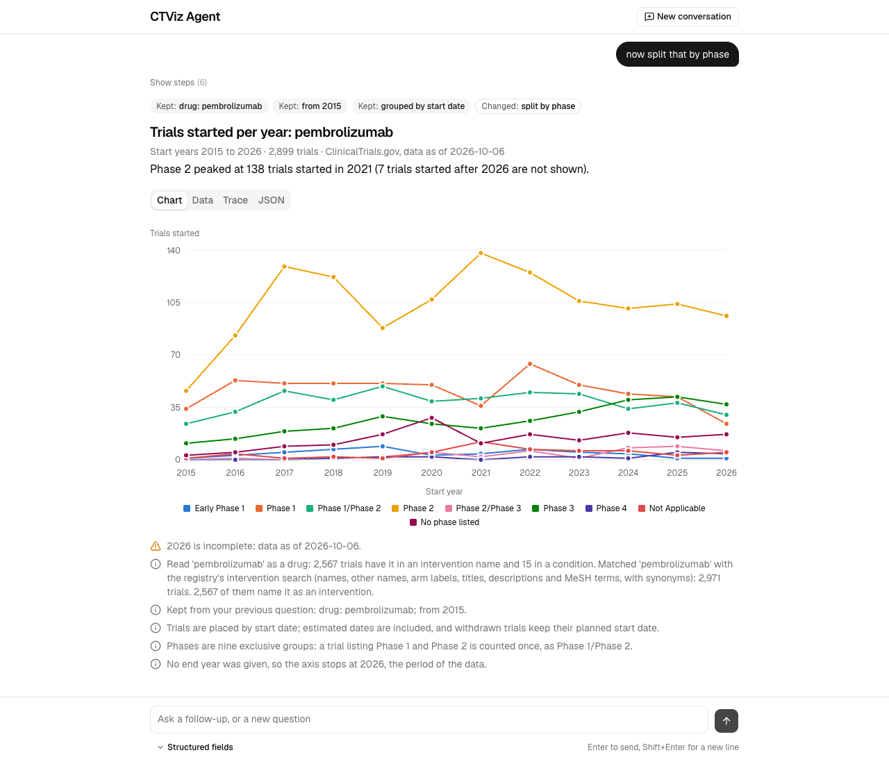
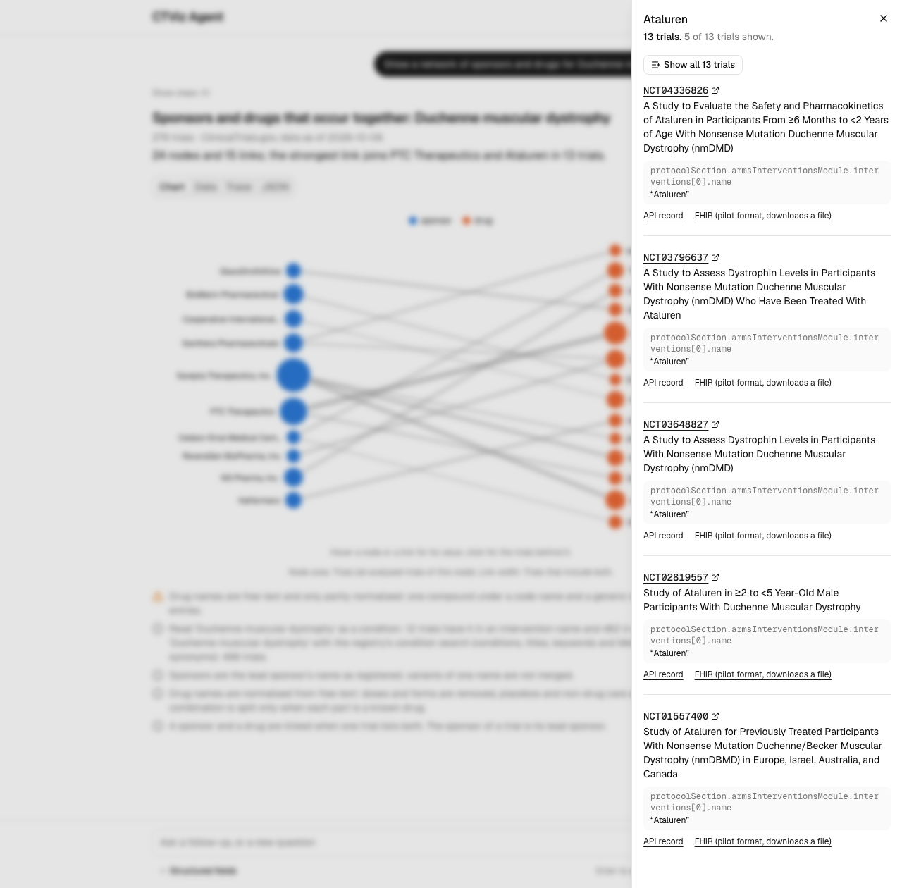
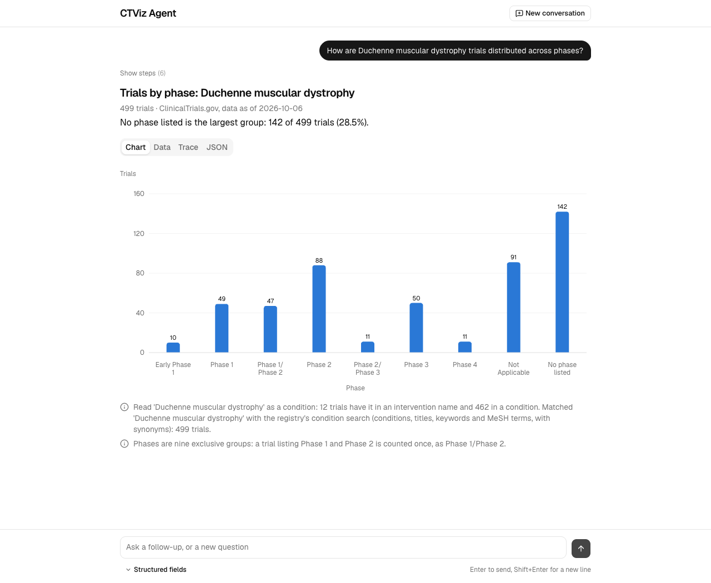
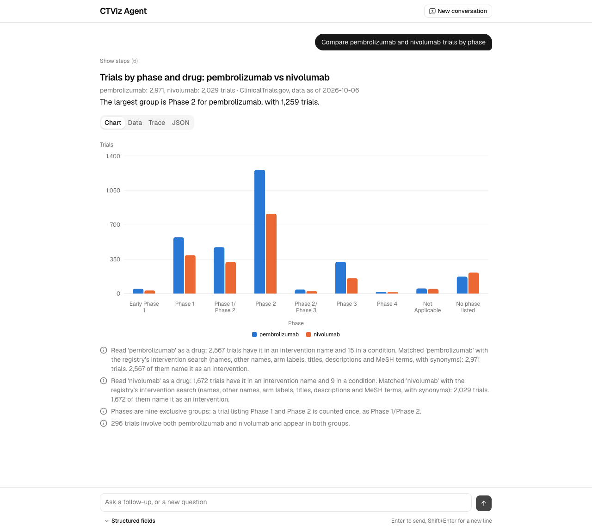
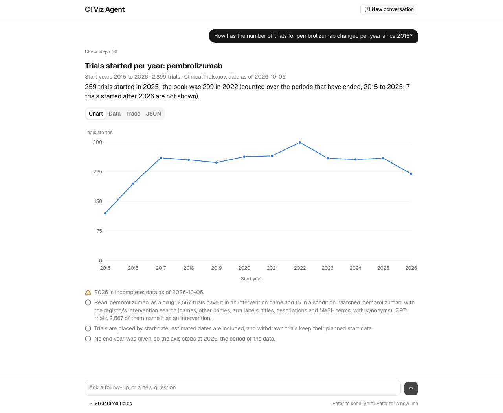
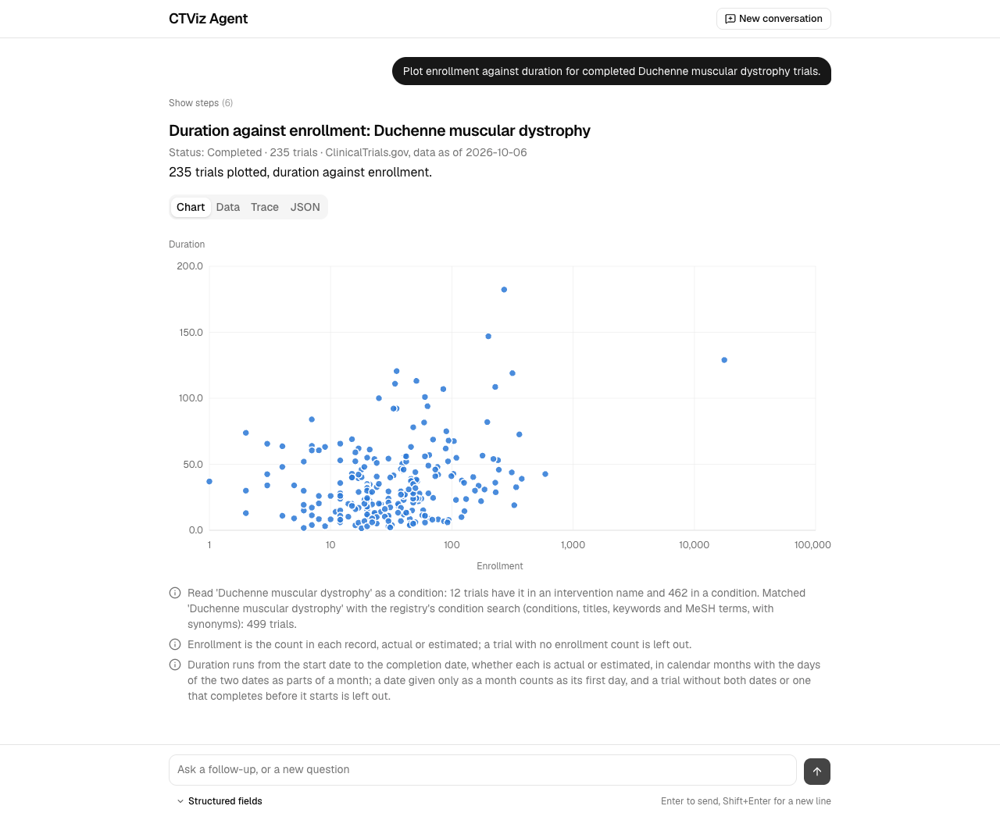
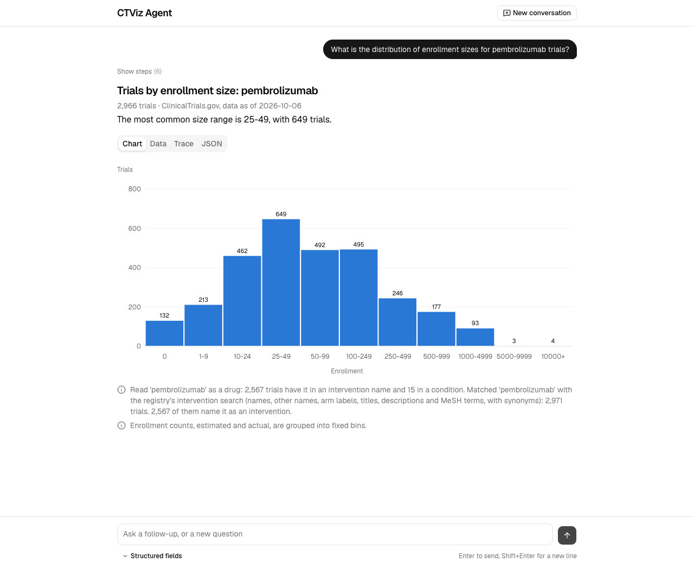
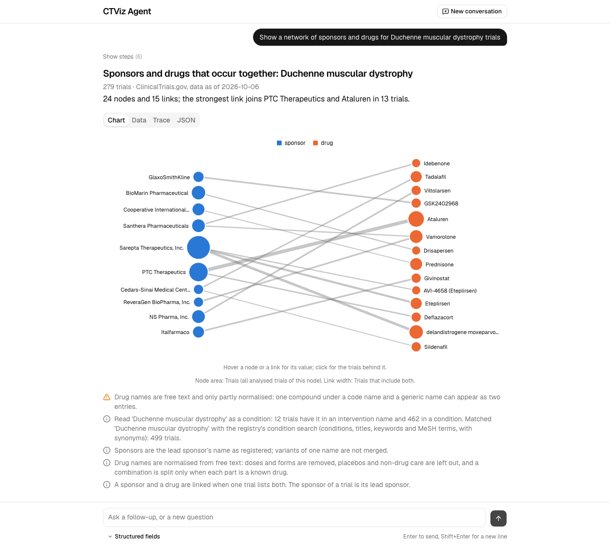

# CTViz Agent: ClinicalTrials.gov question to visualization

Ask a question about clinical trials in plain English and get back a visualization specification (a chart, a number or a table) as JSON, with the trial records that support every value. One model call turns the question into a small typed plan; plain code then runs the plan against the live [ClinicalTrials.gov](https://clinicaltrials.gov) API, counts the trials, chooses one of seven visualization types by rule and writes the citations. The backend is FastAPI; a Next.js chat UI renders the answers.

**Demo video:** [a short walkthrough of the service and its UI](https://drive.google.com/file/d/1SDQznpA6DpLR_ksyTSkuI1vzYERXm6uG/view?usp=share_link) (Google Drive).


*"How has the number of pembrolizumab trials changed per year since 2015?", then "now split that by phase". The chips say what the follow-up kept and what it changed.*


*A sponsor-drug network. Clicking a node opens the trials behind it, each with the record field and the exact text that was counted.*

Every chart type the assignment lists, as drawn by the demo from real answers:

| Bar chart | Grouped bar chart | Time series |
| --- | --- | --- |
|  |  |  |
| **Scatter plot** | **Histogram** | **Network graph** |
|  |  |  |

The service also returns a table and a single number. Also in [`docs/screenshots/`](docs/screenshots/): [live steps while a question runs](docs/screenshots/live-steps-while-running.png), [a greeting and a clarification](docs/screenshots/greeting-and-clarification.png) and [the citation panel after "Show all"](docs/screenshots/citation-panel-show-all.png).

## How to run

With Docker (Compose 2.24 or newer), nothing else needed:

```bash
cp .example.env .env              # optional: put an OpenAI key in .env to enable free-text questions
docker compose up --build --wait  # UI on http://localhost:3000, API and Swagger on http://localhost:8000/docs
docker compose down
```

Without Docker: [uv](https://docs.astral.sh/uv/) 0.12 or newer (it installs Python 3.13), Node 22.22.2 or newer and pnpm 12.

```bash
make setup             # backend and frontend, from their lockfiles
cp .example.env .env   # optional, as above
make dev               # API on http://127.0.0.1:8000, UI on http://localhost:3000
```

The backend alone runs on stock Python 3.12 or newer: `cd backend && python3 -m venv .venv && . .venv/bin/activate && pip install -r requirements.txt && PYTHONPATH=src uvicorn ctviz.api.app:create_app --factory --port 8000`.

**Configuration.** The root `.env` holds `OPENAI_API_KEY`, `OPENAI_API_BASE` and `ALLOWED_MODELS` (see `.example.env`); only the backend container receives it. The planner model is `gpt-5.4-mini`, with `gpt-4.1-mini` asked once if it fails. Every other setting is a `CTVIZ_`-prefixed variable with a default, defined in [`backend/src/ctviz/settings.py`](backend/src/ctviz/settings.py).

**With no key** (or the placeholder key of `.example.env`) the service still serves the ten recorded examples (`GET /v1/examples`, and the UI's example chips, which also work offline), the schemas, `POST /v1/analyses` (a typed plan run against the live registry, no model) and `POST /v1/query` with `"options": {"planner": "structured"}` plus `group_by`. A free-text question without a key is answered `503 planner_unavailable` and names these alternatives.

**Tests.** `make test` runs 1,156 backend tests (about 10 s) and 196 frontend tests, with no key and no network. `make check` adds ruff, `mypy --strict`, a drift check on every generated document, and the frontend's type check, lint and build. `make zip` builds the submission archive and checks it (`backend/scripts/check_submission.py`). There is no automated browser test of the UI.

## How it works

One question, end to end: the assignment's own request, recorded in [`docs/examples/01-assignment-request/`](docs/examples/01-assignment-request/).

```bash
curl -s -X POST http://127.0.0.1:8000/v1/query -H 'Content-Type: application/json' \
  -d '{"query": "How has the number of trials for this drug changed over time?", "drug_name": "Pembrolizumab"}'
```

1. **Plan.** One OpenAI Responses call with a strict structured-output schema. The model sees the question, today's date and the structured fields (and, in a follow-up, the previous question and plan), never trial data, and has no tools. It writes a `QueryPlan` (abridged):
   ```json
   {"entities": [{"kind": "drug", "value": "Pembrolizumab", "role": "filter"}],
    "filters": {"phases": [], "statuses": [], "year_from": null, "year_to": null, "...": "..."},
    "analysis": {"kind": "aggregate", "dimension": "start_date", "series": null, "time_unit": "year", "statistic": null},
    "chart_preference": null}
   ```
2. **Check.** `check_plan` is code: 29 rules fix what can be fixed (each fix is recorded in `meta.interpretation.adjustments`), send what needs language understanding back to the model once, and turn a plan that still fails into a clarification. Here it changed nothing.
3. **Resolve.** Each name is counted exactly under the registry's own search: 2,971 trials match "Pembrolizumab" as an intervention (2,567 name it in an intervention name; read as a condition it would match 2,245, so the answer says how it read the word). 8 requests.
4. **Strategy.** A pure function of the plan and the counts. 2,971 trials is more than one page, so the registry counts each year itself: 28 count requests, 25 for the years (`countTotal=true&pageSize=5`, which also returns the five most relevant trials of the year) and 3 for the edges (no start date, before, after). A question that needs the records (a median, a network, a scatter plot) is a paged walk instead.
5. **Build.** A table of 13 rules maps the plan's shape to a type (here: one date dimension, so a line). Rows, encoding, title, headline, assumptions and warnings come from templates; the five trials returned with each yearly count become that year's citations.
6. **Verify.** 17 invariants run before anything is sent; a response that breaks one is a 500, never a wrong answer.

36 registry requests in all (7 resolution, 1 probe, 28 execution), 7.3 s in total, of which the model took 3.8 s. The response, abridged (two rows, one citation each, long strings cut):

```json
{
  "spec_version": "1.0", "kind": "visualization",
  "message": "259 trials started in 2025; the peak was 299 in 2022 (counted over the periods that have ended, 2008 to 2025; ...",
  "visualization": {
    "type": "time_series", "title": "Trials started per year: Pembrolizumab", "mark": "line", "stack": "none",
    "subtitle": "Start years 2008 to 2026 · 2,959 trials · ClinicalTrials.gov, data as of 2026-10-06",
    "encoding": {
      "x": {"field": "start_year", "type": "temporal", "title": "Start year", "time_unit": "year"},
      "y": {"field": "trial_count", "type": "quantitative", "title": "Trials started", "unit": "trials", "format": ",d"},
      "series": null
    },
    "data": [
      {"start_year": "2016", "trial_count": 195, "citation_count": 195,
       "citations": [{"nct_id": "NCT02852655", "field": "protocolSection.statusModule.startDateStruct.date", "excerpt": "2016-09-21"}, "... 4 more"],
       "source_url": "https://clinicaltrials.gov/api/v2/studies?query.intr=Pembrolizumab&filter.advanced=AREA%5BStartDate%5DRANGE%5B2016-01-01,2016-12-31%5D&countTotal=true&..."},
      "... 18 more rows"
    ]
  },
  "references": {"NCT02852655": {"title": "...", "url": "https://clinicaltrials.gov/study/NCT02852655", "scope_evidence": []}, "...": "76 more"},
  "meta": {"filters": {"drug_name": ["Pembrolizumab"], "...": "..."},
           "interpretation": {"summary": "Counting trials by start_date (per year) for Pembrolizumab.",
                              "chart_rationale": "Rule 5: one date dimension, so a line over time.", "...": "..."},
           "plan": {"...": "the plan above"}, "planner": {"model": "gpt-5.4-mini-2026-03-17", "attempts": 1, "...": "..."},
           "warnings": [{"code": "partial_period", "message": "2026 is incomplete: data as of 2026-10-06."}],
           "counts": {"series": [{"trials_matched": 2971, "trials_analyzed": 2959,
                                  "trials_excluded": [{"reason": "no_start_date", "count": 5}, {"reason": "after_window", "count": 7}]}]},
           "source": {"api_version": "2.0.5", "data_timestamp": "2026-10-06T09:00:05", "requests": ["... 36 requests"]}}
}
```

**Follow-ups and conversation.** The service keeps no session. The client sends the previous question and its `meta.plan` as `previous`; the model returns a complete new plan, and code writes `meta.conversation` (`carried_over`, `changed`) by comparing the two plans. A greeting or small talk is a plan of kind `converse` and gets a templated reply (`kind: "conversation"`, no registry call). A clarification is answered by the next message.

**What the model decides and what code decides.** The model chooses closed values: which words of the question name a drug, condition, sponsor, country or term and whether each is a filter, one side of a comparison or left out; which enum filters the question states, with the phrase that states each; years; and one analysis shape (count by a dimension with an optional split, a statistic of a number, a number per trial, a network of two node kinds, a list of trials). Code decides everything else: the API parameters, every number, row, label, title, sentence, NCT ID, citation and URL.

### Data flow

```
 Browser (chat UI)
    │  HTTP, same origin only
    ▼
 Next.js frontend :3000 ── page + proxy route /api/backend/*
    │  allow-list: v1/query, v1/query/stream, v1/analyses, v1/examples[/slug], v1/capabilities
    │  forwards body and request id, no cookies; passes the SSE stream through unbuffered
    ▼
 FastAPI backend :8000  (one process, no authentication, loopback only in Compose)
    │   ┌─ in-process state ────────────────────────────────────────────────────┐
    │   │ plan cache (1 day) · response cache (1 day, keyed by plan + options +  │
    │   │ registry data version) · registry cache (15 min, single-flight) ·      │
    │   │ token bucket (burst 10, 8/s) · at most 6 requests in flight            │
    │   └───────────────────────────────────────────────────────────────────────┘
    │
    ├──▶ OpenAI Responses API   once per free-text question (at most 3 calls with retry and one repair turn)
    │      sends:  instructions, today's date, the structured request fields, the question,
    │              the previous question and plan in a follow-up
    │      returns: a QueryPlan (structured output). No trial data is ever sent. store=false.
    │      also: GET /models in /readyz, to see that the key lists the configured models
    │
    └──▶ ClinicalTrials.gov Data API v2   read-only GET, no key
           GET /version                                  data version; keys every cache entry
           GET /studies?...&countTotal=true&pageSize=1|5 exact counts: resolution, probes, one per bucket
                                                         (with five sample trials, for the citations)
           GET /studies?...&pageSize=1000&pageToken=...  record reads: a walk; long walks are split into
                                                         date ranges read concurrently

 POST /v1/query/stream runs the same pipeline and writes Server-Sent Events as it goes:
    event: stage   {step: plan|check|resolve|strategy|execute|build, status: started|done, summary, detail}
    event: result  the QueryResponse            (or)   event: error  the error body
 The UI reads the stream to show live steps and falls back to POST /v1/query if no stream arrives.
```

## API reference

**Full schema.** Every endpoint, request and response is described in full by the OpenAPI document that FastAPI generates and Swagger UI displays. With the service running, browse it at [http://localhost:8000/docs](http://localhost:8000/docs) (raw document: [http://localhost:8000/openapi.json](http://localhost:8000/openapi.json)). Without running anything, read the saved copy, [`docs/schema/openapi.json`](docs/schema/openapi.json), which `make check` keeps identical to what the service serves; it opens in any OpenAPI viewer, for example [editor.swagger.io](https://editor.swagger.io). The same types as plain JSON Schema are in [`docs/schema/contract.v1.schema.json`](docs/schema/contract.v1.schema.json), and as tables in [`docs/SCHEMA.md`](docs/SCHEMA.md).

| Endpoint | Purpose | Request | Response |
| --- | --- | --- | --- |
| `POST /v1/query` | Answer a question | JSON [`QueryRequest`](docs/SCHEMA.md#requests) | [`QueryResponse`](docs/SCHEMA.md#queryresponse) |
| `POST /v1/query/stream` | The same, with progress | `QueryRequest` | `text/event-stream` (Server-Sent Events): `stage` events, then one `result` (`QueryResponse`) or one `error` (`ErrorResponse`) |
| `POST /v1/analyses` | Run a typed plan, no model | JSON [`AnalysisRequest`](docs/SCHEMA.md#analysisrequest): `plan`, `options` | `QueryResponse` |
| `GET /v1/examples` | The ten recorded runs | none | JSON list: `slug`, `query`, `kind`, `visualization_type` |
| `GET /v1/examples/{slug}` | One recorded run | slug in the path | JSON: `request`, `plan`, `response` |
| `GET /v1/capabilities` | Dimensions, limits, planner state | none | JSON object |
| `GET /v1/schema/{name}` | JSON Schema (`name` is `contract`) | none | [`contract.v1.schema.json`](docs/schema/contract.v1.schema.json) |
| `GET /healthz` | Liveness | none | `{"status": "ok"}` |
| `GET /readyz` | Registry reachable; models listed by the key | none | `Readiness` ([openapi.json](docs/schema/openapi.json)); 503 only if the registry is unreachable |
| `GET /docs`, `GET /openapi.json` | Swagger UI, OpenAPI document | none | HTML, [`openapi.json`](docs/schema/openapi.json) |

Every non-2xx body is one shape, [`ErrorResponse`](docs/SCHEMA.md#errorresponse): `{"error": {"code", "message", "details", "request_id", "is_retryable"}}`. Codes: 422 `invalid_request` (unknown keys are rejected and named), 404, 405, 500 `internal_error`, 502 `upstream_unavailable`, 503 `planner_unavailable` or `upstream_rate_limited`, 504 `upstream_timeout` or `deadline_exceeded` (45 s). The frontend's proxy adds 502 `backend_unreachable`.

## Request schema

`POST /v1/query` takes a `QueryRequest`. Only `query` is required. Strings are trimmed, an unknown key is a 422, and a structured field wins over the model's reading of the question. Entity fields take one string or up to five, each 1 to 200 characters, and mean "all of"; enum fields mean "any of". Full constraints: [`docs/SCHEMA.md`](docs/SCHEMA.md#requests). Full generated schema: `QueryRequest` in [`docs/schema/openapi.json`](docs/schema/openapi.json), or under Schemas in Swagger UI.

| Field | Type | Meaning |
| --- | --- | --- |
| `query` (required) | string, 1 to 1,000 characters | The question; "this drug" resolves to `drug_name` |
| `drug_name`, `condition`, `sponsor`, `country`, `term` | string or string[] (max 5) | Entities the trials must match. Brand and code names resolve through the registry's search; a country must be one of the registry's country names (aliases and ISO codes accepted) |
| `trial_phase`, `status`, `study_type`, `sponsor_class`, `intervention_type`, `sex`, `age_group`, `allocation`, `masking`, `primary_purpose`, `has_results`, `intervention_model` | enum[] | Closed filters; lenient spellings such as "Phase 2" or "II" are normalised |
| `start_year`, `end_year`, `date_field` | integer 1900 to 2100; `start_date`, `primary_completion_date`, `completion_date` or `first_posted_date` | Year range of the chosen date (default: the date on the time axis, else the start date) |
| `compare` | `{field, values}`, 2 to 5 values | Compare drugs, conditions, sponsors or countries side by side |
| `exclude` | `{drug_name, condition, sponsor, country, term, status}` | Leave out trials that match |
| `group_by`, `time_unit`, `top_n`, `chart_type` | up to two dimensions; `year`, `quarter` or `month`; 1 to 50; one of the seven types | Hints that replace the planner's choice; a chart type the data cannot take is ignored with a warning |
| `previous` | `{query, plan}` | The previous turn, for a follow-up |
| `options` | `{planner, citations_per_datum, drug_match, include_trace, use_cache}` | `planner`: `llm` or `structured` (no model, needs `group_by`); citations 0 to 100 (default 5); `drug_match`: `broad` (registry search) or `name_only`; `use_cache: false` skips the plan and response caches |

22 dimensions can be grouped by: phase, overall status, study type, sponsor class, intervention type, sex, age group, allocation, masking, primary purpose, results posted, intervention model, country, state, sponsor, drug, condition, four dates (by year, quarter or month) and enrollment (binned). Statistics (median, mean, sum) apply to enrollment, duration in months and site count. Network nodes are sponsors, drugs, conditions or countries. Exact lists and limits (at most 10 series, 15 categories by default, 50 at most, 60 network links): `GET /v1/capabilities`.

## Response schema

Every 200 body has the same seven keys, always present (`null` means not applicable, arrays are never null): `spec_version`, `kind`, `message`, `visualization`, `clarification`, `references`, `meta`. Full generated schema: `QueryResponse` in [`docs/schema/openapi.json`](docs/schema/openapi.json), or under Schemas in Swagger UI; as tables in [`docs/SCHEMA.md`](docs/SCHEMA.md#queryresponse).

| `kind` | When | `visualization` |
| --- | --- | --- |
| `visualization` | The question was answered | the specification below |
| `clarification` | A name is missing ("this drug" with no `drug_name`), a placeholder was left in, a value is unknown, or the scope is too broad to read in time. `clarification.options` hold complete request bodies a button can post | `null` |
| `no_data` | The plan ran and nothing matched | `null` |
| `unsupported` | Not about trials, needs data the registry lacks, or an analysis the service does not draw | `null` |
| `conversation` | A greeting, thanks or a question about the service; no registry call | `null` |

`message`, titles, assumptions and warnings are written by code from templates; no sentence the model wrote reaches them.

A `visualization` has `type`, `title`, `subtitle`, `encoding` (channel to row key, with units, number formats, domains and sort) and `data` (flat rows, already aggregated, sorted, zero-filled and truncated, so a renderer never computes). Colours are not sent: colour `i` belongs to `domain[i]`. A period is a label (`2015`, `2024-Q2`) to treat as an ordered category.

<!-- gen:response-types:start -->
| `type` | Extra keys | `encoding` keys | `data` |
| --- | --- | --- | --- |
| `bar_chart` | `orientation`: `vertical` \| `horizontal`; `stack`: `none` \| `stacked` | `x`, `y`, `series`, `tooltip` | One row per (x, series), following `x.domain`; with a series every combination is present. |
| `time_series` | `mark`: `line` \| `bar` \| `area`; `stack`: `none` \| `stacked` | `x`, `y`, `series`, `tooltip` | One row per (period, series), ascending and zero-filled. |
| `histogram` | none | `x`, `x2`, `y`, `label`, `tooltip` | One row per bin, contiguous and ascending. Bins may be uneven: draw one bar per row using the label. |
| `scatter_plot` | none | `x`, `y`, `series`, `size`, `label`, `tooltip` | One row per trial; each row cites itself with the fields its coordinates came from. |
| `network_graph` | `is_directed`: `false`; `layout`: `force` \| `bipartite` | `nodes`, `edges` | Nodes and links; `source` and `target` of a link are node ids. |
| `table` | none | `columns` | One row per record; `href_field` names a row key holding a URL. |
| `metric` | none | `value` | A single number, with citations and `source_url` like any datum. |
<!-- gen:response-types:end -->

A category channel says `is_exclusive: false` when a trial can fall under several values (countries, drugs), and then its values must not be drawn as parts of a whole.

**Citations.** Every datum carries `citations`, `citation_count` and `source_url`. A citation is `{nct_id, field, excerpt}`: `field` is the path in the trial record (`GET /api/v2/studies/{nct_id}`) and `excerpt` the value found there, verbatim (`null` means the field is absent, and the absence is the evidence). `citation_count` is the number of trials behind the datum; up to `options.citations_per_datum` of them (0 to 100, default 5) are cited, chosen by the registry's relevance order for counts or by name match then recency for a walk (`meta.citations.selection` says which). `source_url` is a registry URL that returns exactly the counted trials, where one exists. Trial titles and links are in `references`, once each.

**Metadata** (`meta`, never needed to draw): `filters` (the request fields as applied, so they can be posted back), `interpretation` (summary, chart rule, what the registry made of each name, adjustments), `plan`, `options`, `planner` (model snapshot, attempts, tokens), `conversation`, `assumptions`, `warnings` (code and message), `counts` (trials matched, analysed and excluded, with reasons), `truncation`, `citations`, `source` (API version, data timestamp, every upstream request), `suggested_followups` (request bodies for chips), `cache`, `timing`, `debug.trace`. Field by field: [`docs/SCHEMA.md`](docs/SCHEMA.md#metadata), and as JSON Schema in [`docs/schema/`](docs/schema/).

## Key design decisions and tradeoffs

- **The model writes a plan and never data.** One structured call, closed choices, then code. The model never writes a number, row, NCT ID, title or API parameter; every entity and filter it names is checked against the words of the question (29 plan rules, a repair turn at most once). The cost: a question outside the plan's vocabulary is a clarification or "unsupported", not an improvised answer. The worst a wrong plan can do is a valid answer to a different question, which `meta.interpretation.summary` states in words written by code.
- **The plan is also the replay input.** `QueryPlan` is what the model writes, what `POST /v1/analyses` accepts and what every response returns, so any answer can be re-run with no model and the same data version gives the same chart.
- **Two exact data paths, chosen by rule.** The registry has no group-by. A count request per bucket is exact at any size; a paged walk reads every matching trial (large scopes split into date ranges read concurrently) and serves open vocabularies, networks, scatter plots and statistics. Tests require both paths to give the same result on the same records. There is no cap on trials, only on time: a scope too large to read before the 45 s deadline gets an explicit `too_broad` clarification stating its size, never a silent sample.
- **One field catalogue, one engine.** 22 dimensions sit behind every aggregated chart; adding one is one catalogue entry. A trend is a date dimension, a distribution a category, a comparison several scopes, a network two dimensions. The engine counts trials (or takes a median, mean or sum of enrollment, duration or site count) and has no results data.
- **Verified before sending.** 17 invariants run on every visualization: shapes JSON Schema cannot check, that every NCT ID was returned by the registry in this request, that every excerpt equals the value in the record held in memory, and that a count equals the `totalCount` of its request. A failure is a 500, not an answer with false evidence.
- **Text is templated, citations are replayable.** No model sentence reaches a title, headline or warning. Citations are a sample (five trials by default) of the counted ones, so that a bar of 900 trials does not carry 900 records; `source_url` returns the full set.
- **Stateless follow-ups.** The client sends the previous plan back; there is no session store, so the service scales without one and a follow-up is testable like any request. A refusal or clarification plan is never cached, so one unlucky reading is not repeated.
- **Rejected:** a generative-UI layer (the model would retype data rows); a free tool-calling loop (the model would read data and write numbers); a keyword planner without a model (it cannot read entity names, so "lung cancer trials by phase" would chart all 606,007 trials); the website's undocumented facet endpoint; a bulk download into a local database (stale against weekday refreshes); FHIR as the data source (one study per request, so 2,971 requests for the example above).

## Example runs

Ten recorded runs (the assignment asked for 3 to 5): each folder in [`docs/examples/`](docs/examples/) holds the request, the plan the service ran and the complete, unedited response, with every citation and the trace. [`docs/examples/README.md`](docs/examples/README.md) has the full index.

| Run | Question | Visualization |
| --- | --- | --- |
| [01](docs/examples/01-assignment-request/response.json) | How has the number of trials for this drug changed over time? (`drug_name`: Pembrolizumab) | time series, line |
| [02](docs/examples/02-compare-phases/response.json) | Compare phases for trials involving pembrolizumab vs nivolumab. | grouped bars |
| [03](docs/examples/03-recruiting-by-country/response.json) | Which countries have the most recruiting trials for lung cancer? | horizontal bars |
| [04](docs/examples/04-sponsor-drug-network/response.json) | Show a network of sponsors and drugs for Duchenne muscular dystrophy trials. | bipartite network |
| [05](docs/examples/05-drug-cooccurrence/response.json) | Which drugs frequently co-occur in combination studies with pembrolizumab? | force network |
| [06](docs/examples/06-enrollment-histogram/response.json) | What is the distribution of enrollment sizes for pembrolizumab trials? | histogram |
| [07](docs/examples/07-enrollment-vs-duration/response.json) | Plot enrollment against duration for completed Duchenne muscular dystrophy trials. | scatter plot |
| [08](docs/examples/08-largest-trials/response.json) | List the 10 largest lung cancer trials. | table |
| [09](docs/examples/09-recruiting-count/response.json) | How many recruiting trials are there for Duchenne muscular dystrophy? | metric |
| [10](docs/examples/10-no-drug-named/response.json) | The first question again, with no drug named | clarification |

Replay any of them without a model: `jq -c '{plan: .meta.plan, options: .meta.options}' docs/examples/04-sponsor-drug-network/response.json | curl -s -X POST http://127.0.0.1:8000/v1/analyses -H 'Content-Type: application/json' -d @- | jq -r .message`.

## How correctness was validated

- **Offline tests:** 1,156 backend and 196 frontend tests with the network blocked. They cover Essie escaping, odd real record shapes (a 1985 record, a trial with 14 arms, a withheld record), each of the 29 plan rules, 15 of the 17 invariants by corrupting a response and expecting that rule, the model adapter against canned SDK responses, the API through an ASGI transport with a scripted planner, and the equality of the count path and the record path on the same records.
- **Citation audit** (68 responses, a script that re-fetches every cited record from the registry): all 3,832 cited trials exist, with the right title and URL; all 7,045 excerpts equal the value at their field path; every cited trial is returned by the registry's own search for the question's scope. It also found defects, fixed since: 122 of 721 scatter points cited evidence that did not show a site count, and 31 of 693 `source_url` totals did not equal the datum. One finding stands: in 121 of 2,816 strict checks (4.3%) the cited trial does not name the searched entity in its own record, because the registry's search also matches synonyms and MeSH terms; `scope_evidence` is not filled in. This audit ran before the fixes; a second run over the ten recorded examples afterwards found no failure of the existence, title, excerpt, count or `source_url` checks (762 trials, 2,649 excerpts, 64 URLs).
- **Aggregation audit.** Live: 533 questions on large scopes (diabetes, Duchenne, pembrolizumab, and others) in 18 families, answered by the service and recomputed independently from the raw registry records, 9,972 result rows compared. Before the fixes 24 cases were flagged (top-N membership and the "Other" count under a comparison, site counts, duration and site-count definitions, scatter points with no site, replays that differed in their warnings) and 138 wording flags were raised (for example the catch-all "Other" named as the largest group, a future year named as the peak, ties not stated). A second audit read the engine's code and probed it with synthetic records (count path against record path, top-N, date windows). The defects were fixed in one commit with tests; the full live batch was not run again afterwards, so the fixes are tested at that scale only by the unit tests.
- **Thirteen hard prompts** (several filters, several measures, exclusions, five-way comparisons) were run on the final code: 12 drew a chart and 1 was refused (three measures in one question). Of the twelve, one added a split the question did not ask for (sponsor class), one matched the drug class "GLP-1 receptor agonists" by its name only (with a warning), one drew the sponsor distribution where the question asked for the top five against the rest, and one did not apply a requested highlight (and said so); two carried a "not applied" note although the chart showed what was asked.
- **Against the registry:** the 499 Duchenne trials of 2026-10-06 are reference figures in the tests (nine phase buckets add up to 499). Posting each of the ten recorded plans to `/v1/analyses` against the live registry today gives back the recorded visualization, references and message unchanged. Early planner checks: [`docs/spikes.md`](docs/spikes.md).

## Limitations and what I would improve

- **A drug class is not expanded to its members.** "GLP-1 receptor agonists" searches that phrase; the response warns (`drug_name_barely_matches`) when the name appears in few intervention names. Drug aliases (a code name and a generic name) are not merged when grouping by drug, so drug counts are lower bounds.
- **One measure per question.** Several measures in one question (a count, a total enrollment and a recruiting count) are refused.
- **Chart wishes are not applied.** Highlighting a threshold or annotating a bar is reported as "not applied", and that note can appear when nothing was asked for.
- **Wording changes counts.** Synonymous condition wordings ("heart attack", "myocardial infarction") reach different trial sets in the registry's search. The phase filter means "lists this phase" (so Phase 2 includes Phase 1/Phase 2) while chart buckets are exclusive, which the notes state.
- **The model's reading varies between runs** for some questions (an extra split, a different entity kind). The plan cache makes a repeated question stable; the checks bound the damage; there is no repeated-run scorecard.
- **Citations are samples, and scope evidence is empty.** A cited trial can look unrelated because the registry matches synonyms; nothing per trial says why it matched.
- **Very broad questions are refused, not sampled.** Sample-then-recount is not built; a scope too large to read in time gets a `too_broad` clarification.
- **Not supported:** investigator or site networks, maps, results data, reading trial text. No browser test of the UI, one process with no login, and the caches and rate limiter are not shared between processes. The registry's rate limit is undocumented; the defaults come from a short measured ramp.

With more time: an evaluation harness with repeated runs and golden replays; scope evidence per cited trial; drug-class and alias resolution from the registry's own terms; sample-then-recount; a shared cache and limiter in Redis; an automated browser test.

## How this was built

I used AI-assisted development deliberately throughout this project, primarily to accelerate implementation, testing, documentation, and other repetitive engineering work rather than to substitute for system design.

Before implementation began, I worked through the architecture, data flow, API boundaries, visualization schema, aggregation strategy, failure modes, and major design tradeoffs. These decisions were captured in an implementation plan that I reviewed and approved before coding started. Where there were multiple reasonable approaches, I used discussions with Claude-family models to explore the tradeoffs, then cross-checked important assumptions and decisions with OpenAI models to identify missed edge cases or alternative approaches.

Claude Code served as the primary coding harness and was used to implement much of the code, tests, and supporting documentation from that plan. The application planner itself uses `gpt-5.4-mini` through the OpenAI Responses API, with `gpt-4.1-mini` as a fallback. The backend is built with Python 3.13, FastAPI, Pydantic, httpx, the OpenAI SDK, uv, ruff, mypy, and pytest. The frontend uses Next.js 16, React 19, shadcn/ui, Recharts, d3-force, and Vitest.

I also used a separate model family as a review layer rather than relying only on the model that produced an implementation. The test suite and adversarial query set were reviewed and extended using OpenAI-family models, with particular attention to aggregation correctness, citation behavior, ambiguous queries, unsupported assumptions, and edge cases in ClinicalTrials.gov data. This helped reduce the risk of a single model both introducing and overlooking the same class of error.

AI-based review was only one part of validation. I also performed manual checks without model assistance. These included inspecting representative ClinicalTrials.gov responses directly, tracing selected queries through the planner and execution pipeline, manually verifying filters and aggregation logic against returned study records, checking deduplication behavior for multi-site and multi-intervention studies, reviewing citations against their underlying sources, and comparing rendered visualizations with the aggregated data passed to the frontend. I also exercised the application interactively to catch UI, loading, error-handling, and integration issues that are easy to miss in automated tests.

The final system was validated through offline test suites, live planner checks, citation and aggregation audits, difficult end-to-end prompts, re-recorded example outputs, manual spot checks, and screenshots captured from the running application. Generated artifacts such as the schema reference, example index, frontend types, and documentation tables are derived directly from the code and are checked for staleness during the build. The ten examples shown in this repository are recorded system outputs rather than manually constructed examples.

Overall, AI was used as an engineering multiplier: for implementation speed, repetitive work, exploration, adversarial review, and test generation. I retained responsibility for the architecture, design choices, constraints, evaluation criteria, manual verification, and final validation of the system.

## Data source and attribution

All trial data comes from [ClinicalTrials.gov](https://clinicaltrials.gov), a service of the U.S. National Library of Medicine, through its public [Data API](https://clinicaltrials.gov/data-api/api) (v2.0.5, data of 2026-10-06 for the recorded runs); every response names the source and its data timestamp in `meta.source`. Use is subject to the site's [terms](https://clinicaltrials.gov/about-site/terms-conditions); this project is not affiliated with the NLM or NIH. Free-text questions are read by an OpenAI model that receives the question, today's date and the request fields, and no trial data.
